> 🌐 Language: 中文 | [English](/docs/README_en.md)

<div align="center">

# MantisZip


轻量级全功能 Windows 压缩/解压软件
</p>

<p align="center">
  <a href="https://buy.polar.sh/polar_cl_VaCaW2l2nWkob5CyHe4dOlhL6HrQDK4ueMA9n1JyhNc"></a>
  <a href="https://afdian.com/a/MantisZen"></a>
  <a href="https://dotnet.microsoft.com/"></a>

  [](https://qm.qq.com/cgi-bin/qm/qr?k=778347352) 
  [](https://discord.gg/PpuyhceJpZ)

</p>

----


 ⏱️ 3 秒总览：在压缩包内无缝切换、指哪打哪的极速预览体验

> 免费开源  / 基于 .NET 9 + WPF   
> 🤖 由 [OpenCode](https://opencode.ai) 及 [Reasonix](https://reasonix.io) 辅助开发
</div>

----

<p align="center">
  <b>👁 预览</b> &nbsp;·&nbsp; <b>🔑 密码管理器</b> &nbsp;·&nbsp; <b>⚙️ 高级解压选项</b>
</p>

---

## 📚 简介

MantisZip 是一款面向 Windows 的免费开源压缩/解压工具，主打**文件内预览**和**密码管理器**等便捷功能。无需解压即可直接查看压缩包内的图片、文本、Markdown、HTML 文件内容。


## ✨ 功能亮点与专项特写

### 👁️ 文件内预览

可以在压缩包内直接预览 **图片**、**文本**、**HTML/Markdown**、**SVG**、**字体** 等内容。

#### 🔍 深度探索：各类型高级预览特写

<table width="100%">
  <tr>
    <td width="50%" valign="top">
      <b>🖼️ 媒体与图片类预览</b><br>
      支持 PNG 透明通道展示、压缩包内 GIF 动画直接嵌套播放。
      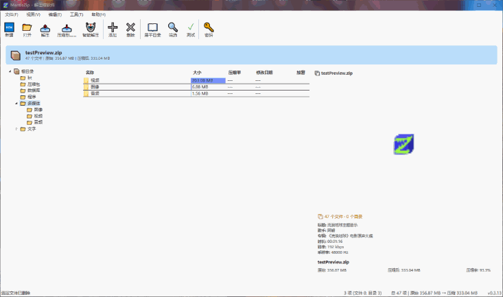
    </td>
    <td width="50%" valign="top">
      <b>📄 文档与排版类预览</b><br>
      无缝切换纯文本、Markdown 实时渲染、HTML 及 PDF，以及字体字形预览。
      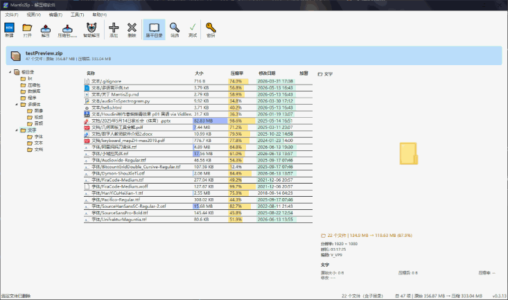
    </td>
  </tr>
</table>

#### 部分格式支持**元数据展示**（无需加载完整文件）：

<details>
<summary><b>📊 点击展开：查看硬核数据类预览（SQLite 数据库、CSV、BT 种子、ISO）</b></summary>

| 预览类型 | 展示信息 |
|----------|----------|
| PE 可执行文件（exe/dll） | 公司、产品名、文件版本、架构、子系统、描述 |
| PDF 文档 | 版本、页数、标题、作者、加密状态 |
| Office 文档（docx/xlsx/pptx） | 标题、作者、页数/幻灯片数/工作表数 |
| 音频（WAV / FLAC） | 时长、采样率、位深、声道、码率 |
| 视频（MP4 / MKV / AVI） | 分辨率、时长、编码 |
| 数据库（SQLite） | 编码、页面大小、表数量 |
| 光盘映像（ISO） | 卷标、格式、大小 |
| BT 种子 | InfoHash、文件树、Magnet 链接、Tracker、创建者 |
</details>


### 🔑 智能密码管理器


保存常用密码，可以根据规则自动尝试匹配密码。

如果一个文件输入过正确密码，可以选择保存记录，下次打开与解压则无需再次输入密码。密码以 DPAPI 加密存储。

支持导入导出（明文 JSON），方便备份和迁移。密码库上限 1000 条，自动尝试密码仅前 100 条，防止暴力破解滥用。

<details>
<summary><b>📊 点击展开：密码与规则设置与匹配</b></summary>
<p align="center">
  <br>
  压缩时可以选择从密码库加载密码，或者手动输入新密码

  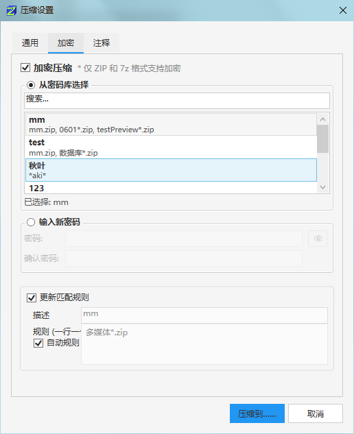

  如果打开一个有密码的文件会提示输入密码并保存规则

  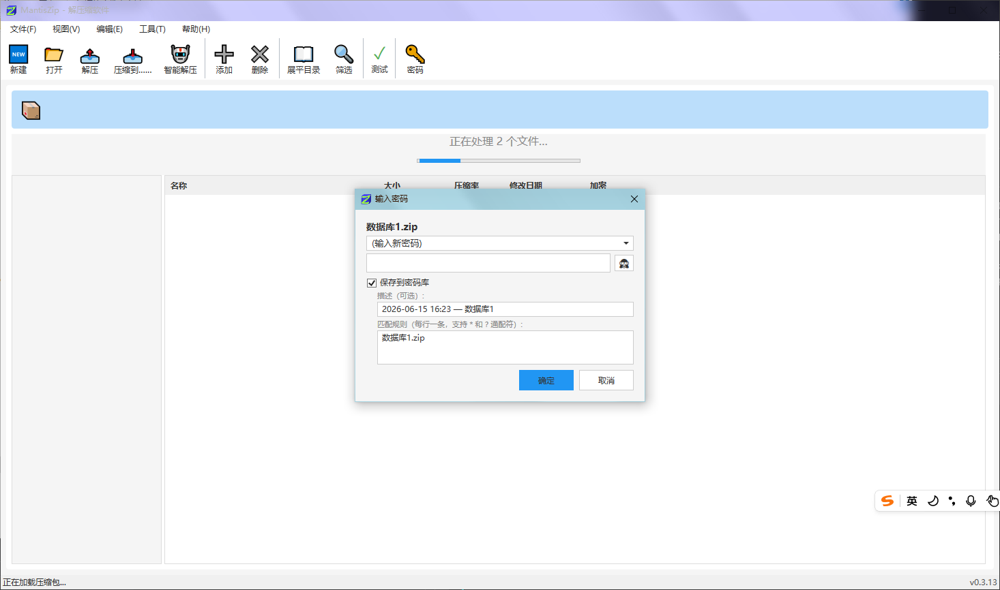

  当压缩包正确设置密码与匹配规则，再次打开则无痕自动匹配，并且不影响预览功能。

  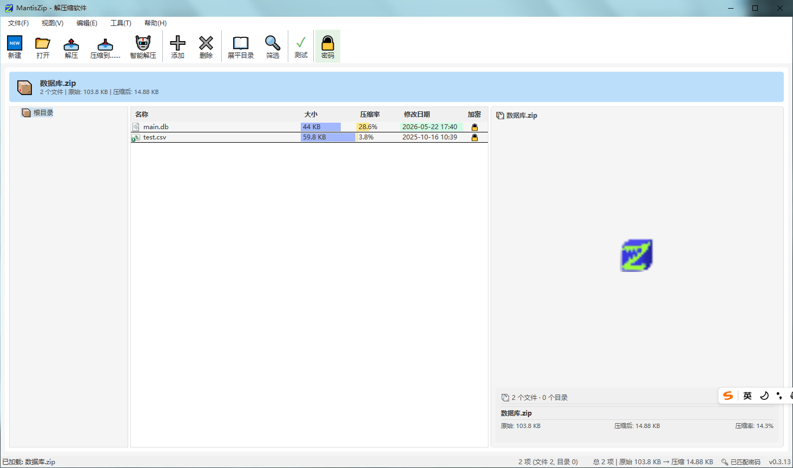

  当压缩包没有正确设置密码与匹配规则，则会显示加锁图标，并且不能预览。

  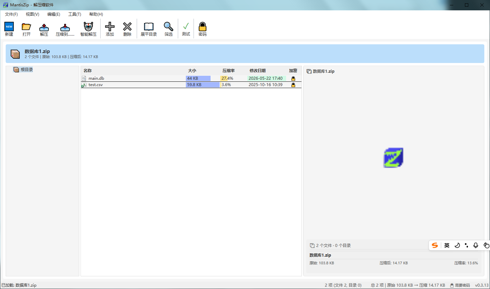
</p>
</details>

### ⚡ 更多解压冲突选项

除了其他软件的「覆盖」「跳过」和「自动重命名」之外，还增加了「覆盖旧文件」和「覆盖小文件」，「自动重命名」也可无缝切换至手动重命名。

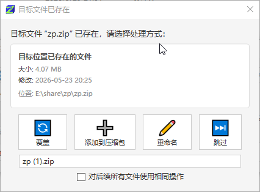

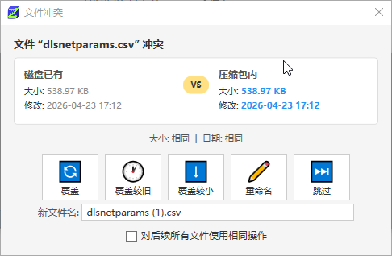

### 文件列表增强

<details>
<summary><b>📊 点击展开：展平目录与过滤工具</b></summary>
<p align="center">
  <br>


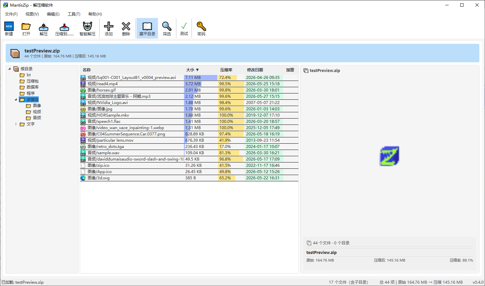

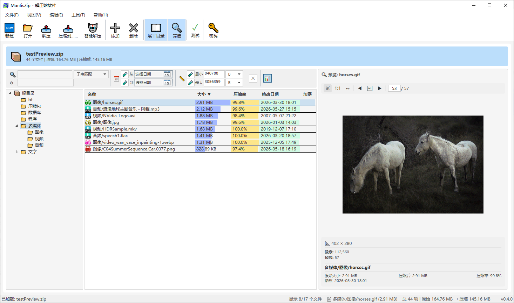

</p>
</details>


### 🐞 调试日志

开启后记录详细操作日志到 `debug.log`，帮助排查问题。提供**隐私脱敏**选项，避免泄露用户隐私。

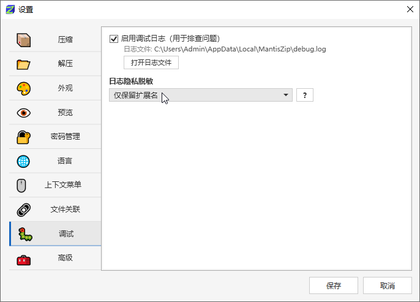

---

## 🤔 已知问题
- 本软件亮点是功能和易用性，所以性能上稍逊于主流压缩软件。将来会逐渐优化。
- **拖拽导出**功能使用 7‑Zip 的 eager-extraction 模式（先全部解压到临时目录再发起拖拽），大文件较多时会有延迟。该功能默认关闭，可在设置里打开。未来会将 WPF 界面替换为 Avalonia 以原生解决该平台的延迟渲染限制。
- 预览 Markdown、HTML、SVG、PDF 目前使用 WebView2 控件，已拦截所有外部网络请求（仅允许 `file://` 本地访问）。未来迁移至 Avalonia 后架构将进一步轻量化。
- 有些格式的压缩包**不支持**单项预览，预览时会有提示。
- RAR 格式不支持压缩（只读解压）。
- 目前只支持 Windows 平台，跨平台支持已在计划中。


---

## 📦 支持的格式 | Supported Formats

| 格式 | 压缩 | 解压 | 加密 |
|------|:----:|:----:|:----:|
| ZIP | ✅ | ✅ | ✅ AES-256 |
| 7z | ✅ | ✅ | ✅ |
| TAR | ✅ | ✅ | ❌ |
| GZ / TGZ | ✅ | ✅ | ❌ |
| RAR | ❌ | ✅ | ✅ |
| ISO | ❌ | ✅（只读浏览） | ❌ |

---

## 📋 系统要求

- **操作系统**: Windows 10 (1809+) / Windows 11 （跨平台支持已在计划中）
- **运行时**: [.NET 9 Runtime](https://dotnet.microsoft.com/download/dotnet/9.0)
- **WebView2 Runtime**: HTML/Markdown/SVG/PDF 预览依赖 [WebView2 Runtime](https://developer.microsoft.com/microsoft-edge/webview2/)

---

## 🔧 构建方法

```powershell
# 克隆仓库
git clone [https://github.com/mantis3d/MantisZip.git](https://github.com/mantis3d/MantisZip.git)
cd MantisZip

# 构建
dotnet build src\MantisZip.UI\MantisZip.UI.csproj

# 运行
dotnet run --project src\MantisZip.UI\MantisZip.UI.csproj

# 运行测试
dotnet test tests\MantisZip.Tests\MantisZip.Tests.csproj
```

**输出路径**: `src/MantisZip.UI/bin/Debug/net9.0-windows/MantisZip.UI.exe`

---

## ⌨️ 命令行

MantisZip 支持强大的命令行调用（例如右键菜单集成）。

```powershell
# 打开压缩包浏览
MantisZip.UI.exe --open "D:\文档.zip"

# 快速压缩（默认设置直接压缩）
MantisZip.UI.exe --compress-quick "D:\照片" -- "D:\备份.zip"
```

完整参数列表见 [命令行使用指南](docs/CLI.md)。

---

## 🏗 项目架构

关于项目的底层模块划分与技术栈架构设计，请参见 [项目架构文档](docs/ARCHITECTURE.md)。

---

## 📄 许可证 | License

本项目使用 **MIT 许可证** — 详见 [LICENSE](LICENSE) 文件。  
This project is licensed under the MIT License.

---

## 📦 下载与安装 | Download

| 节点 (Location) | 下载渠道 (Channel) | 提取码/凭证 (Credentials) | 适用人群 (Target) |
| :--- | :--- | :--- | :--- |
| **夸克网盘** | [👉 点击前往夸克极速下载](https://pan.quark.cn/s/ae193b2aa11b) | **`mTZH`** | **国内推荐**！移动端/PC端不限速，支持一键转存与极速同步。 |
| **百度网盘** | [👉 点击前往百度网盘下载](https://pan.baidu.com/s/1CJXNu1M1ARkH2hf48mfb-g?pwd=yevn) | **`yevn`** | 国内常规备用通道，方便习惯使用百度云盘生态的用户下载。 |
| **官方 QQ 群** | [👉 点击一键加入交流群 (778347352)](https://qm.qq.com/cgi-bin/qm/qr?k=778347352) | *无需验证* | **核心推荐**！进群文件一键极速下载，获取最新测试版、调教作者与Bug反馈。 |

---

## 🙏 致谢与依赖

MantisZip 的诞生离不开全球开源社区的无私奉献。在此，对本项目所依赖的优秀开源库、工具及创作者致以最崇高的敬意。

### 📦 核心第三方依赖库


#### MantisZip.Core

| 包名 | 版本 | 用途 | 许可证 |
|------|------|------|--------|
| [SharpCompress](https://github.com/adamhathcock/sharpcompress) | 0.48.1 | ZIP/TAR/GZ 压缩和解压核心引擎（替代 SharpZipLib）| MIT |
| [SharpSevenZip](https://github.com/sevenzipsharp/SevenZipSharp) | 2.0.45 | 7z/RAR/ISO 压缩和解压（封装 7z.dll）| LGPL-2.1 |
| [SharpZipLib](https://github.com/icsharpcode/SharpZipLib) | 1.4.2 | 测试用（仅 test 项目） | MIT |
| [System.Security.Cryptography.ProtectedData](https://github.com/dotnet/runtime) | 10.0.8 | DPAPI 加密存储密码 | MIT |

#### MantisZip.UI

| 包名 | 版本 | 用途 | 许可证 |
|------|------|------|--------|
| [CommunityToolkit.Mvvm](https://github.com/CommunityToolkit/dotnet) | 8.4.2 | MVVM 辅助（仅用部分基类） | MIT |
| [Markdig](https://github.com/xoofx/markdig) | 1.2.0 | Markdown → HTML 渲染 | BSD-2-Clause |
| [Ookii.Dialogs.Wpf](https://github.com/ookii-dialogs/ookii-dialogs-wpf) | 5.0.1 | Vista 风格文件夹选择对话框 | BSD-3-Clause |
| [Ude.NetStandard](https://github.com/jehugaleahsa/udetector) | 1.2.0 | Mozilla 字符编码检测（文本预览） | MIT |
| [WpfAnimatedGif](https://github.com/XamlAnimatedGif/WpfAnimatedGif) | 2.0.2 | GIF 动画支持 | MIT |
| [Microsoft.Web.WebView2](https://developer.microsoft.com/microsoft-edge/webview2/) | 1.0.3967.48 | HTML/Markdown/SVG/PDF 预览（替代 WPF WebBrowser）| BSD-3-Clause |

#### 外部工具（运行时依赖）

| 工具 | 用途 | 许可证 | 备注 |
|------|------|--------|------|
| [7z.dll](https://www.7-zip.org/) | 7z/RAR 原生解析（SharpSevenZip 绑定） | GNU LGPL | 随应用分发，动态链接 |

---
---

### 🤖 智能化开发辅助

本项目在敏捷开发与重构过程中，深度借助了以下先进的 AI 编程智能体，实现了独立开发生产力的跨越式飞跃：

- [OpenCode](https://opencode.ai) 负责底层核心异步架构的搭建与 .NET 9 高级特性重构。
- [Reasonix](https://reasonix.io) 负责核心业务功能（如免解压文件预览、智能密码管理器）的高效开发、深度联调与 Bug 修复。
- [DeepSeek](https://www.deepseek.com) 全程提供底层硬核编程大语言模型的能力支撑。

*(特别感谢上述 AI 工具及其背后开发团队的卓越工作！)*

---

## 💖 支持项目

MantisZip 是一款完全免费且独立开发的开源项目。如果它提升了你的工作效率，不妨为作者注入一些继续开发的动力！☕  


### 🌐 境外赞助
如果您身处海外，推荐通过 Polar 赞助。支持国际信用卡、Apple Pay 等无缝支付：
<p align="left">
  <a href="https://buy.polar.sh/polar_cl_VaCaW2l2nWkob5CyHe4dOlhL6HrQDK4ueMA9n1JyhNc">
    
    
  </a>
</p>

---

### 🇨🇳 国内赞助
如果您在国内，支持通过 **爱发电（微信/支付宝）** 或 **微信直接打赏**。您可以直接扫描下方二维码：

<table width="100%">
  <tr>
    <td width="50%" align="center" valign="top">
      <a href="https://afdian.com/a/MantisZen">
      <b>⚡ 在爱发电上支持我</b><br>      
        
      <br><i>(点击或扫码前往爱发电主页)</i>
      </a>
    </td>
    <td width="50%" align="center" valign="top">
      <b>💚 微信直接打赏</b><br><br>
      
      <br><i>(欢迎请作者喝杯热咖啡)</i>
    </td>
  </tr>
</table>


---


### 💬 交流与反馈 (Community)

如果你在体验《MantisZip》的过程中遇到了 Bug、有新的功能想法，或者单纯想和同行切磋 WPF/.NET 独立开发技术，欢迎加入我们的开发者社区：

* **QQ 交流群**：`778347352`（👉 [点击一键加入群聊](https://qm.qq.com/cgi-bin/qm/qr?k=778347352)）
* **代码库提交**：[提交 Bug 或 Feature Request](../../issues)
* **Discord 交流群**: （👉 [点击一键加入群聊](https://discord.gg/PpuyhceJpZ)）

> 💡 **小提示**：进群请备注 “GitHub / MantisZip”。