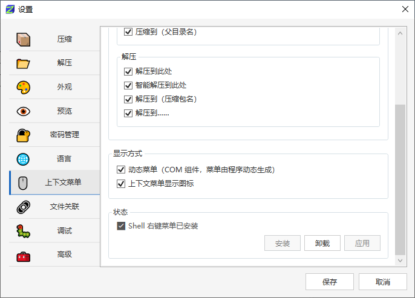
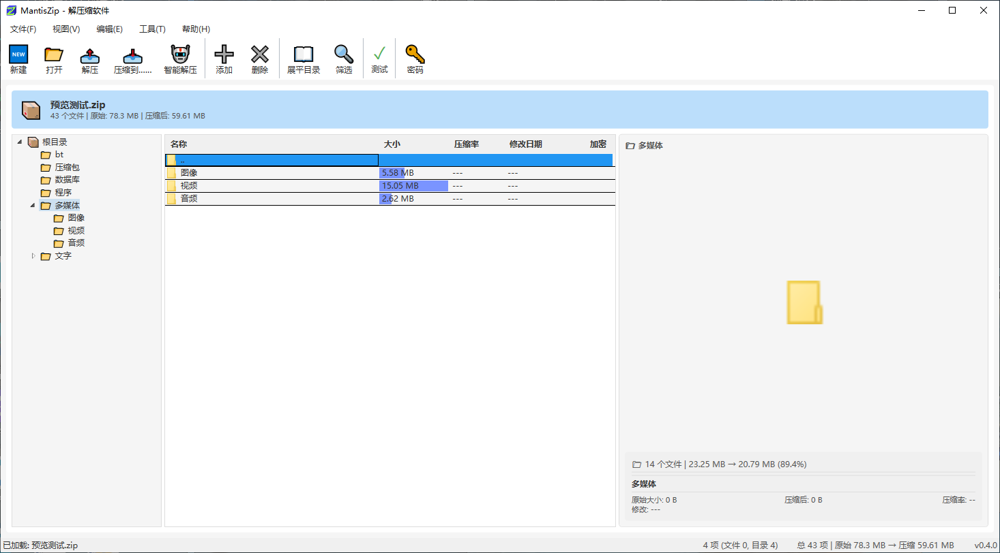

## v0.4.1

### 文件说明 / File Description

MantisZip-0.4.1-Setup-NoDotNet.exe 是需要安装 dotnet runtime 才能运行的。MantisZip-0.4.1-Setup.exe 是自包含 dotnet runtime 的。

MantisZip-0.4.1-Setup-NoDotNet.exe requires the .NET runtime to be installed. MantisZip-0.4.1-Setup.exe is self-contained with the .NET runtime.

**如果你不明白上面那句话是什么意思，请下载 MantisZip-0.4.0-Setup.exe。**

**If you don't understand what the above means, please download MantisZip-0.4.0-Setup.exe.**

### 更新内容 / Changelog

- 修复上下文动态菜单有时不能起效的问题，并增加了不使用动态菜单的选项
- Fixed issue where dynamic context menus sometimes didn't work, and added an option to disable dynamic menus
- 
- 文件列表增加回到父目录的行
- Added a "go to parent directory" row in the file list
- 
- 文件列表目录回车改成进入该目录
- Changed Enter key on directories in the file list to navigate into that directory

## v0.4.0

### 文件说明 / File Description

MantisZip-0.4.0-Setup.exe 是需要安装 dotnet runtime 才能运行的。MantisZip-0.4.0-Setup-SelfContained.exe 是自包含 dotnet runtime 的。

MantisZip-0.4.0-Setup.exe requires the .NET runtime to be installed. MantisZip-0.4.0-Setup-SelfContained.exe is self-contained with the .NET runtime.

**如果你不明白上面那句话是什么意思，请下载 MantisZip-0.4.0-Setup-SelfContained.exe。**
**If you don't understand what the above means, please download MantisZip-0.4.0-Setup-SelfContained.exe.**

### 软件第一个版本 / First Release

- 软件功能基本完整，测试基本完成。
- Core features are complete and testing is largely finalized.
- 
- 

## v0.0.0

# Release Notes / 发布说明

> **每次发布前在此文件顶部写入本次更新的内容，CI 会自动将其作为 GitHub Release 的说明文字。**
> **Write the update notes at the top of this file before each release. CI will automatically use them as the GitHub Release description.**
>
> 保留之前版本的记录在下面供参考，上面最新内容会被 CI 读取。
> Keep records of previous versions below for reference. The latest content at the top will be read by CI.
