## v0.5.0

### 更新内容 / Changelog

## v0.4.5

### 文件说明 / File Description

MantisZip-0.4.5-Setup-WebSetup.exe 是需要联网才能安装的。MantisZip-0.4.5-Setup-Offline.exe 是离线安装包。MantisZip-0.4.5-Portable.zip 是便携版，解压即用。

MantisZip-0.4.5-Setup-WebSetup.exe requires internet during installation. MantisZip-0.4.5-Setup-Offline.exe is a fully offline installer. MantisZip-0.4.5-Portable.zip is the portable version, extract and run.

### 更新内容 / Changelog

- 完成 [压缩选项增强](.omo/plans/compression-options-enhancement.md) 计划 — 7z 字典大小、固实块、Word Size、匹配器可配置；ZIP 压缩方法（Deflate/Deflate64/BZip2/LZMA/PPMd/Store）可配置；ZIP/7z 加密方式可配置，7z 支持加密文件名开关
- Completed [Compression Options Enhancement](.omo/plans/compression-options-enhancement.md) plan — configurable 7z dictionary size, solid block, word size, match finder; configurable ZIP compression method (Deflate/Deflate64/BZip2/LZMA/PPMd/Store); configurable ZIP/7z encryption method, 7z encrypt headers toggle
- 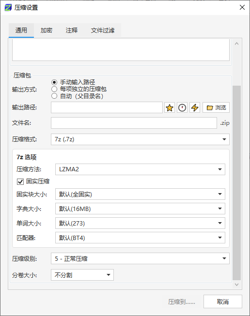
- 完成 [文件过滤功能](.omo/plans/file-filter-feature.md) 计划 — 支持按扩展名、文件名、尺寸、日期过滤，可保存为命名预设
- Completed [File Filter](.omo/plans/file-filter-feature.md) plan — filter by extension, filename, size, or date range; supports named presets persisted in settings
- 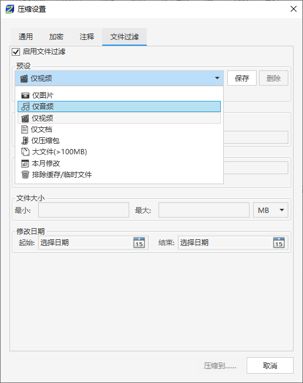
- 新增便携模式，CI 自动生成 Portable 压缩包
- Added portable mode; CI automatically generates Portable zip
- 解压路径统一 — `ExtractSelectedAsync` 改为调用引擎 `ExtractEntriesAsync`
- Unified extract path — `ExtractSelectedAsync` now delegates to engine `ExtractEntriesAsync`
- 视图菜单新增"隐藏预览信息"开关，预览信息面板可独立显隐控制
- Added "Hide Preview Info" toggle in View menu for independent control of preview info panel visibility
- 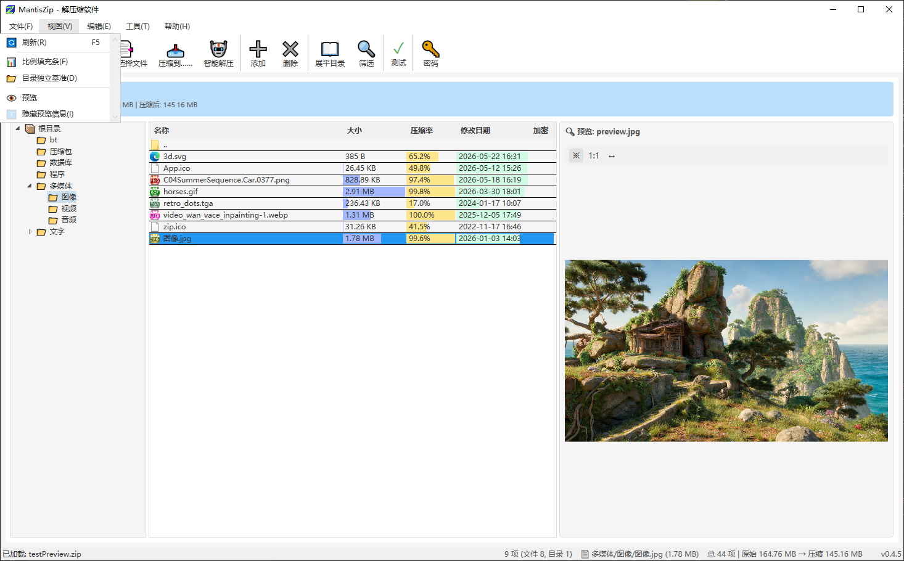
- 可配置双击行为 — 设置窗口新增"双击压缩包"选项（打开/原地解压/智能原地解压/打开解压窗口），`--open` CLI 按配置路由 (#16)
- Configurable double-click behavior — new "double-click archive" option in Settings (open/extract-here/smart-extract/extract-dialog); `--open` CLI routes accordingly
- 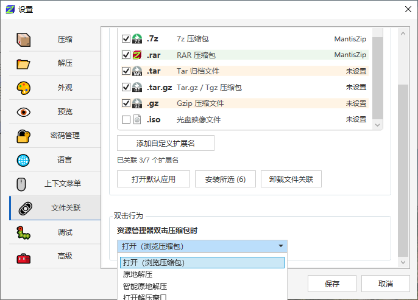
- 解压后自动删除原压缩包 — 新增"解压完成后将原压缩包移到回收站"选项，(#16)
- Auto-delete archive after extraction — new option to move original archive to Recycle Bin
- 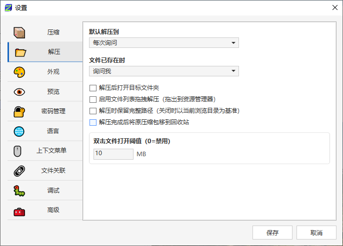
- 文件冲突窗口增加“暂停”和“取消”按钮。(#25)
- Add ‘Pause’ and ‘Cancel’ buttons to the file conflict window.
- 
- 修复安装后会导致别的软件安装完启动时错误本软件的问题。
- Fixed issue where installing other software could incorrectly route their startup to MantisZip.

## v0.4.4

### 文件说明 / File Description

MantisZip-0.4.4-Setup-WebSetup.exe 是需要联网才能安装的。MantisZip-0.4.4-Setup-Offline.exe 是离线安装包。

MantisZip-0.4.4-Setup-WebSetup.exe requires internet during installation. MantisZip-0.4.4-Setup-Offline.exe is a fully offline installer.

### 更新内容 / Changelog

- 完成 [魔数检测预览系统](.omo/plans/preview-magic-detection.md) 计划 — 通过文件内容（魔数）识别真实格式预览，不再依赖扩展名
- Completed [Magic Detection Preview System](.omo/plans/preview-magic-detection.md) plan — identifies file formats by content (magic bytes) for preview, no longer relies on file extensions
- 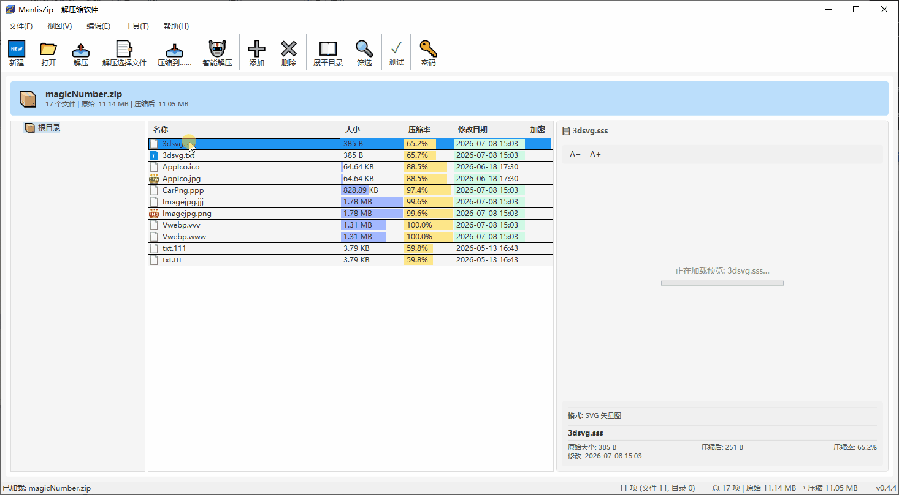
- 魔数检测结果与扩展名不一致时，可在工具栏切换"按扩展名/按魔数"预览
- When magic detection conflicts with the file extension, toggle between "by extension / by magic number" preview in the toolbar
- 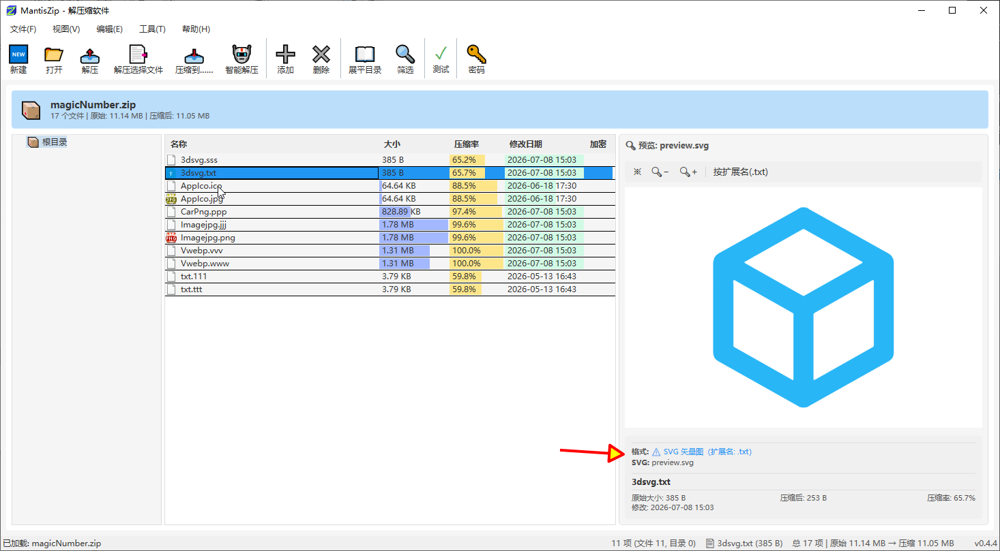
- 完成压缩包路径处理一站式重构 `ArchivePath`，统一了散落在各处的路径处理代码，并修复了加密压缩解压的多处 bug
- Completed one-stop archive path refactoring (`ArchivePath`), unified scattered path handling code, and fixed multiple encryption-related compression/extraction bugs
- 密码流程统一重构 — 统一密码入口 `ResolvePasswordAsync`，调用方大幅简化
- Unified password flow refactoring — centralized password entry via `ResolvePasswordAsync`, significantly simplified callers
- 双击文件用系统默认程序打开（可在设置中调整阈值）
- Double-click files to open with system default program (threshold configurable in settings)
- 安装包增强，文件名重命名：`WebSetup`（联网）/ `Offline`（离线），联网安装包可自动下载所需依赖
- Installer improvements: renamed to `WebSetup` (online) / `Offline` (offline); online installer automatically downloads required dependencies
- 离线安装包新增自包含模式，无需安装 .NET Runtime
- Offline installer now includes self-contained mode, no .NET Runtime installation required

## v0.4.3

### 文件说明 / File Description

MantisZip-0.4.3-Setup-NoDotNet.exe 是需要安装 dotnet runtime 才能运行的。MantisZip-0.4.3-Setup.exe 是自包含 dotnet runtime 的。

MantisZip-0.4.3-Setup-NoDotNet.exe requires the .NET runtime to be installed. MantisZip-0.4.3-Setup.exe is self-contained with the .NET runtime.

**如果你不明白上面那句话是什么意思，请下载 MantisZip-0.4.3-Setup.exe。**

**If you don't understand what the above means, please download MantisZip-0.4.3-Setup.exe.**

### 更新内容 / Changelog

- 完成 [快速路径选择](.omo/plans/quickpath-unified.md) 计划。
- Completed [Quick Path Selection](.omo/plans/quickpath-unified.md) plan.
- 快速路径选择，在"浏览"按钮旁边加上三个用于切换路径的按钮。（灵感来自软件 Listary）
- Quick Path Selection: added three buttons next to the "Browse" button for switching paths. (Inspired by Listary)
- 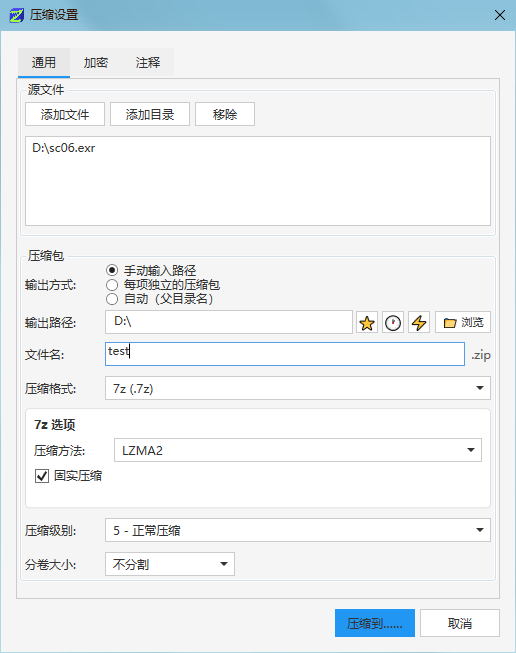
- 可以把常用路径加入书签，在"书签"按钮弹出菜单里面选择并切换。
- Frequently used paths can be bookmarked and selected via the "Bookmark" button popup menu for quick switching.
- 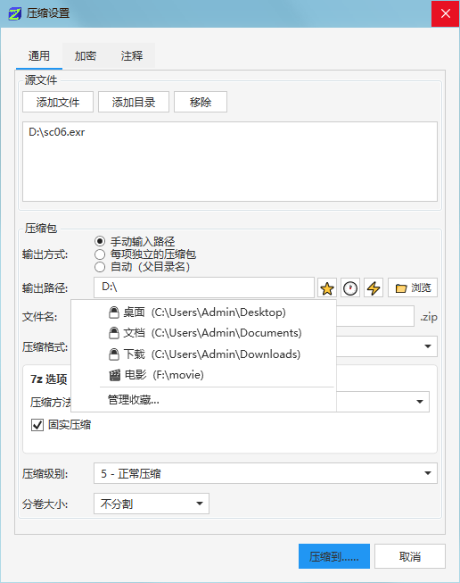
- 可以在书签管理器里面管理书签。
- Bookmarks can be managed in the Bookmark Manager.
- 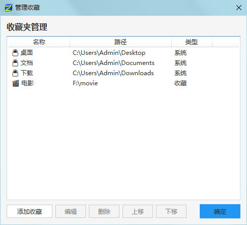
- "历史"按钮，弹出菜单里面会显示最近的用到的目录并切换。
- The "History" button shows recently used directories in a popup menu for quick switching.
- 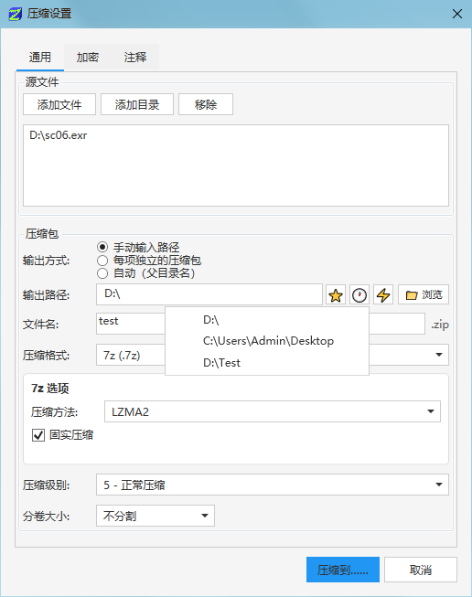
- "切换"按钮，弹出菜单里面会显示此时打开的资源管理器目录并切换。
- The "Switch" button shows currently open Explorer directories in a popup menu for quick switching.
- 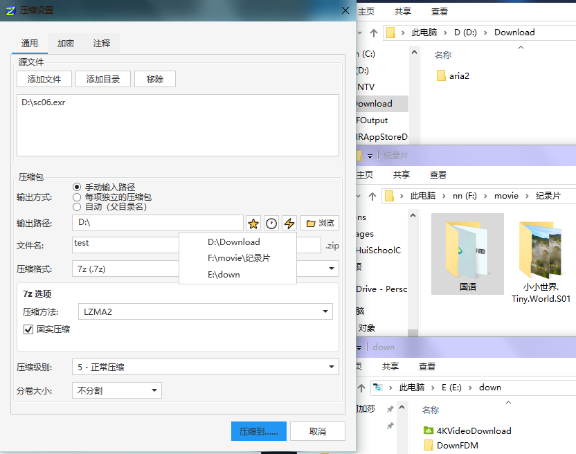

## v0.4.2

### 文件说明 / File Description

MantisZip-0.4.2-Setup-NoDotNet.exe 是需要安装 dotnet runtime 才能运行的。MantisZip-0.4.2-Setup.exe 是自包含 dotnet runtime 的。

MantisZip-0.4.2-Setup-NoDotNet.exe requires the .NET runtime to be installed. MantisZip-0.4.2-Setup.exe is self-contained with the .NET runtime.

**如果你不明白上面那句话是什么意思，请下载 MantisZip-0.4.2-Setup.exe。**

**If you don't understand what the above means, please download MantisZip-0.4.2-Setup.exe.**

### 更新内容 / Changelog

- 修复上下文动态菜单有时会闪烁的问题。
- Fixed issue where dynamic context menus sometimes flickered.
- 修复安装时选择语言和外观无效的问题（感谢 Peiming_The_Blank）。
- Fixed issue where language and appearance selection during installation was ineffective (thanks to Peiming_The_Blank).
- 完成计划 [zip 复制模式](.omo/plans/zipengine-sharpcompress-migration.md)，添加删除文件不再是"解压缩→重新压缩"，而改成了"复制模式"。速度极大提升。
- Completed plan: [ZIP copy mode](.omo/plans/zipengine-sharpcompress-migration.md). Adding/deleting files now uses "copy mode" instead of "decompress → recompress". Significantly faster.
- 完成计划 [权限提升](.omo/plans/uac-elevation-permission.md)，当压缩解压到无权限的目录时，会有正确的处理（感谢 xieyilin.main）。
- Completed plan: [UAC elevation](.omo/plans/uac-elevation-permission.md). Proper handling when compressing/extracting to directories without permission (thanks to xieyilin.main).
- 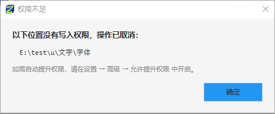
- 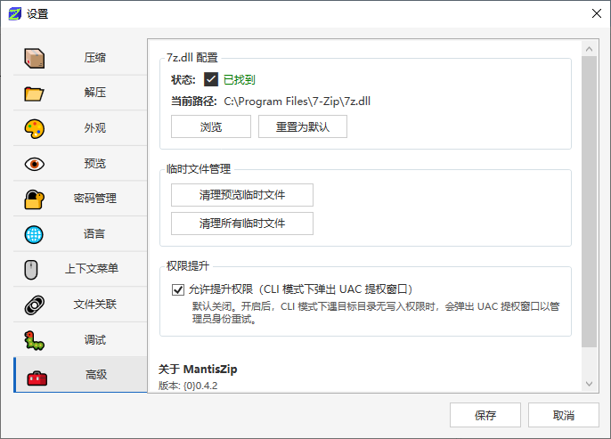
- 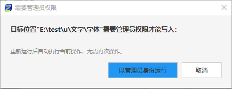

## v0.4.1

### 文件说明 / File Description

MantisZip-0.4.1-Setup-NoDotNet.exe 是需要安装 dotnet runtime 才能运行的。MantisZip-0.4.1-Setup.exe 是自包含 dotnet runtime 的。

MantisZip-0.4.1-Setup-NoDotNet.exe requires the .NET runtime to be installed. MantisZip-0.4.1-Setup.exe is self-contained with the .NET runtime.

**如果你不明白上面那句话是什么意思，请下载 MantisZip-0.4.0-Setup.exe。**

**If you don't understand what the above means, please download MantisZip-0.4.0-Setup.exe.**

### 更新内容 / Changelog

- 修复上下文动态菜单有时不能起效的问题，并增加了不使用动态菜单的选项
- Fixed issue where dynamic context menus sometimes didn't work, and added an option to disable dynamic menus
- 
- 文件列表增加回到父目录的行
- Added a "go to parent directory" row in the file list
- 
- 文件列表目录回车改成进入该目录
- Changed Enter key on directories in the file list to navigate into that directory

## v0.4.0

### 文件说明 / File Description

MantisZip-0.4.0-Setup.exe 是需要安装 dotnet runtime 才能运行的。MantisZip-0.4.0-Setup-SelfContained.exe 是自包含 dotnet runtime 的。

MantisZip-0.4.0-Setup.exe requires the .NET runtime to be installed. MantisZip-0.4.0-Setup-SelfContained.exe is self-contained with the .NET runtime.

**如果你不明白上面那句话是什么意思，请下载 MantisZip-0.4.0-Setup-SelfContained.exe。**
**If you don't understand what the above means, please download MantisZip-0.4.0-Setup-SelfContained.exe.**

### 软件第一个版本 / First Release

- 软件功能基本完整，测试基本完成。
- Core features are complete and testing is largely finalized.
- 
- 

## v0.0.0

# Release Notes / 发布说明

> **每次发布前在此文件顶部写入本次更新的内容，CI 会自动将其作为 GitHub Release 的说明文字。**
> **Write the update notes at the top of this file before each release. CI will automatically use them as the GitHub Release description.**
>
> 保留之前版本的记录在下面供参考，上面最新内容会被 CI 读取。
> Keep records of previous versions below for reference. The latest content at the top will be read by CI.
