## v0.5.0

### 版本介绍

这是 MantisZip 的一次**大版本更新**，核心框架从 WPF 完全迁移到 Avalonia，界面全面重构，安装包大幅精简。主要更新内容：

**框架与架构**
- **核心框架从 WPF 迁移到 Avalonia**（.NET 9），界面全面重构，WPF 版进入维护模式
- **去除 WebView2 依赖** — HTML/Markdown/PDF/SVG 全部改为原生渲染，安装包大幅精简，安装不再需要额外运行时
- **自实现 GIF 解码器与字体预览引擎** — GIF 动画不再依赖 WpfAnimatedGif；字体预览改用 HarfBuzzSharp+SkiaSharp，支持自动连字检测
- 新增 **Animated WebP** 动画预览，与 GIF 统一处理

**预览能力**
- 新增 **Office 文档内容预览** — DOCX 大纲导航+全文+表格、XLSX DataGrid 表格、PPTX 原始坐标定位预览（WPF 版仅显示元数据）
- **预览面板位置四档布局** — 右下 / 文件列表下方 / 目录树下方 / 侧边四种摆放位置，可独立显隐，切换实时生效并记忆尺寸
- 打开压缩包自动展示**注释**（ZIP GBK/UTF-8 编码兼容 + RAR5）
- **元数据信息面板可配置** — 字段排布自定义，独立配置文件持久化
- **透明棋盘格切换** — 🏁 按钮切换 GIF/动画透明背景显示

**交互**
- **拖拽双向** — 从窗口拖文件到资源管理器**实时解压**（Win32 覆层三色指示+动态光标+Esc 取消）；从资源管理器拖文件**添加到压缩包**（绿色覆层即时提示）
- **自定义文件选择器** — 多选累积、目录树、收藏/历史/窗口速选、盘符下拉、文件类型筛选，替代系统对话框
- **加密压缩包密码交互对齐** — 工具栏「密码」按钮三态化（禁用/红锁/绿锁）；可列出条目的加密包取消密码后仍可浏览，随时补输解锁
- **文件列表列排序增强** — 三态循环（升序→降序→原始顺序）+ 列头箭头 + 排序状态跨会话持久化
- **目录行聚合显示** — 目录行大小/日期/压缩后大小由子树聚合得出，一眼看清目录内容规模

**外观**
- **紧凑度模式** — Compact/Normal/Loose 三档间距与控件高度，运行时切换无需重启
- **主题三态化** — 跟随系统 / 亮色 / 暗色（WPF 版仅亮/暗），新增全局界面字体设置
- **保存布局** — 拖动列宽/预览面板调整后可一键保存，下次启动自动恢复
- 新增**目录树自动展开**开关 — 自动展开到当前浏览位置

### 文件说明 / File Description

- MantisZip-0.5.0-Setup-WebSetup.exe 是需要联网才能安装的。
- MantisZip-0.5.0-Setup-Offline.exe 是离线安装包。
- MantisZip-0.5.0-Portable.zip 是便携版，解压即用。
- MantisZip-0.5.0-Portable-Web.zip 是无依赖便携版，需要电脑安装有 dotnet9 运行时才能正常使用。

- MantisZip-0.5.0-Setup-WebSetup.exe requires internet during installation. 
- MantisZip-0.5.0-Setup-Offline.exe is a fully offline installer. 
- MantisZip-0.5.0-Portable.zip is the portable version, extract and run. 
- MantisZip-0.5.0-Portable-Web.zip is a dependency-free portable version that requires the .NET 9 runtime to be installed on your computer.

### 更新内容 / Changelog

- 核心框架从 WPF 迁移到 Avalonia（.NET 9 跨平台就绪，MVVM 架构重构），WPF 版进入维护模式
- Core framework migrated from WPF to Avalonia (.NET 9, cross-platform ready, MVVM architecture); WPF version enters maintenance mode
- 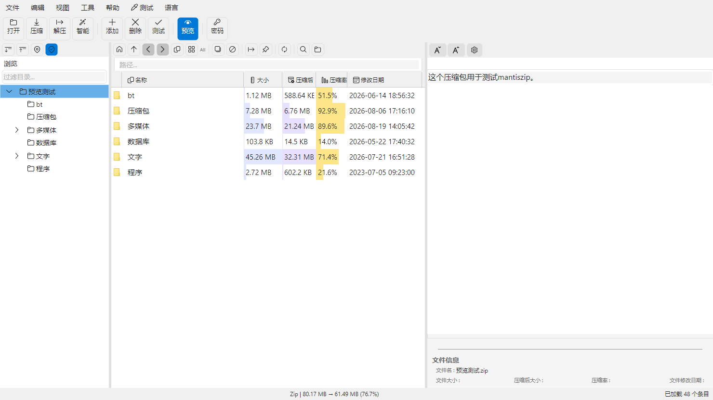
- 移除 WebView2 依赖 — HTML/Markdown 改为原生控件树渲染（ReverseMarkdown→Markdig），PDF 改为 PdfPig+SkiaSharp 逐页位图，SVG 改为 Svg.Skia 栅格化；安装不再需要 WebView2 Runtime
- Removed WebView2 dependency — HTML/Markdown rendered as native control trees (ReverseMarkdown→Markdig), PDF rendered page-by-page via PdfPig+SkiaSharp, SVG rasterized via Svg.Skia; no WebView2 Runtime required
- 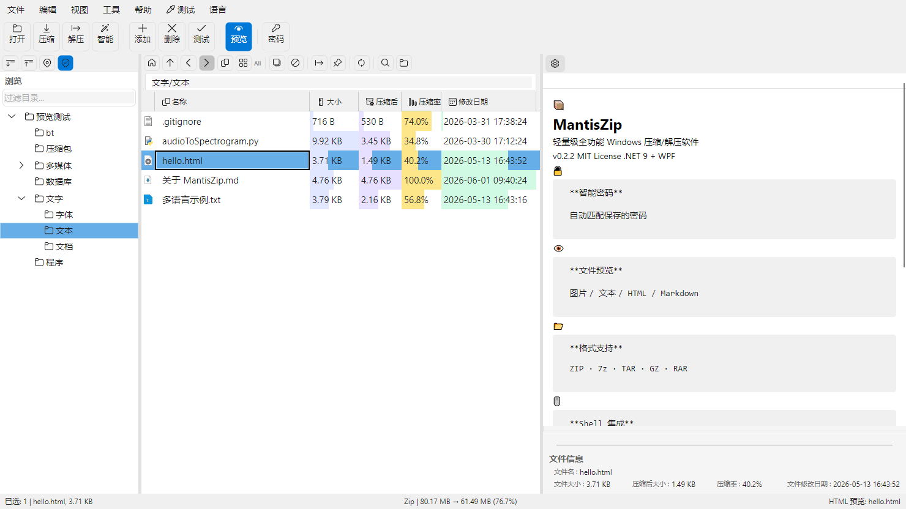
- 自实现 GIF 解码器与字体预览引擎 — GIF 动画不再依赖 WpfAnimatedGif；字体预览改用 HarfBuzzSharp+SkiaSharp 位图渲染（含自动连字检测）
- Self-implemented GIF decoder and font preview engine — GIF animation no longer relies on WpfAnimatedGif; font preview uses HarfBuzzSharp+SkiaSharp bitmap rendering (with automatic ligature detection)
- 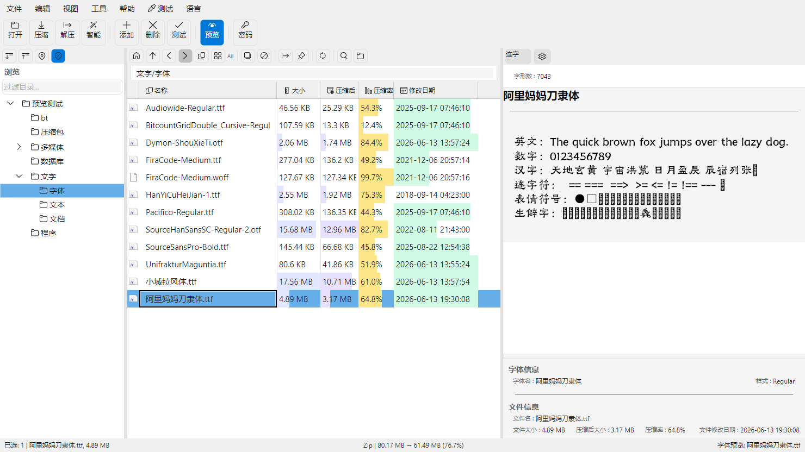
- 新增 Animated WebP 动画预览 — 与 GIF 动画统一处理，静态 WebP 保持图片预览
- Added Animated WebP preview — unified with GIF animation handling; static WebP stays as image preview
- GIF/动画透明棋盘格切换 — 🏁 按钮切换透明背景显示
- GIF/animated transparency checkerboard toggle — 🏁 button switches transparent background display
- 新增 Office 文档内容预览 — DOCX 大纲导航+全文+真 Grid 表格、XLSX DataGrid 表格、PPTX 原始坐标定位预览（WPF 版仅显示元数据）
- Added Office document content preview — DOCX outline navigation + full text + real Grid tables, XLSX DataGrid tables, PPTX original-coordinate positioned preview (WPF version only showed metadata)
- 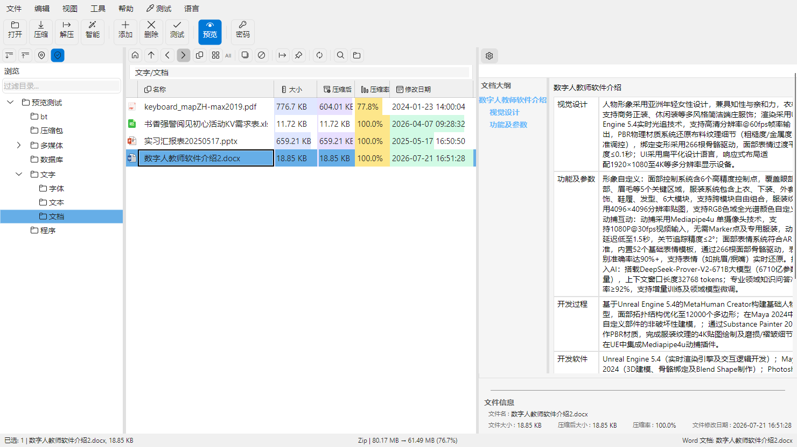
- 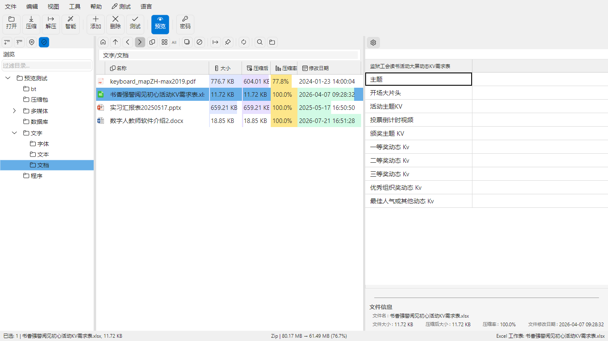
- 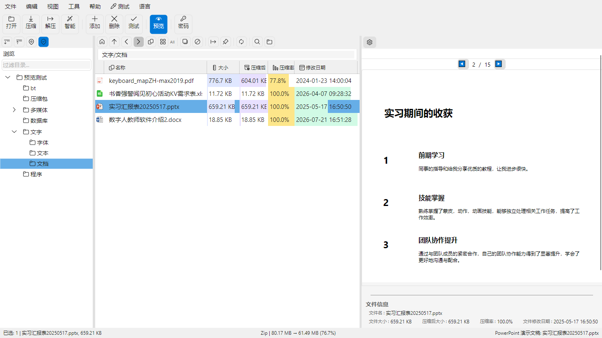
- 打开压缩包自动展示注释 — 支持 ZIP 注释（GBK/UTF-8 编码兼容）与 RAR5 注释读取
- Archive comments shown automatically on open — supports ZIP comments (GBK/UTF-8 compatible) and RAR5 comment reading
- 新增紧凑度模式 — Compact/Normal/Loose 三档间距与控件高度，运行时切换无需重启
- Added compactness mode — Compact/Normal/Loose spacing and control heights, switchable at runtime without restart
- 新增全局界面字体设置
- Added global UI font setting
- 主题三态化 — 跟随系统 / 亮色 / 暗色（WPF 版仅亮/暗）
- Theme tri-state — System / Light / Dark (WPF version only had Light/Dark)
- 
- 新增结果预览面板 — 压缩/解压设置窗口实时文件树预览，冲突高亮、过滤灰显、精简模式、异步加载
- Added result preview panel — real-time file tree preview in compress/extract dialogs with conflict highlighting, filtered ghosting, compact mode, async loading
- 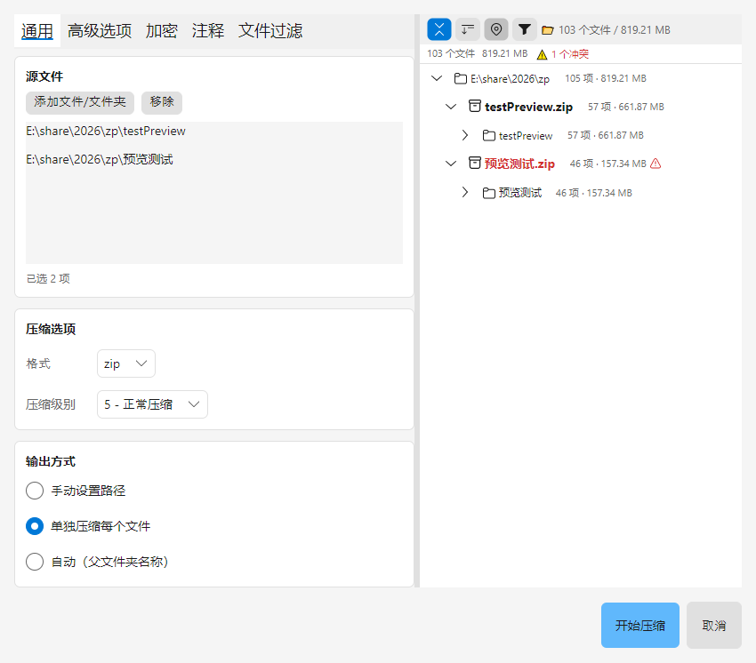
- 元数据信息面板可配置 — 字段排布自定义（信息栏/内容区顶部/隐藏+行+顺序），独立配置文件持久化
- Configurable metadata info panel — custom field layout (info panel / content top / hidden + row + order), persisted in a separate config file
- 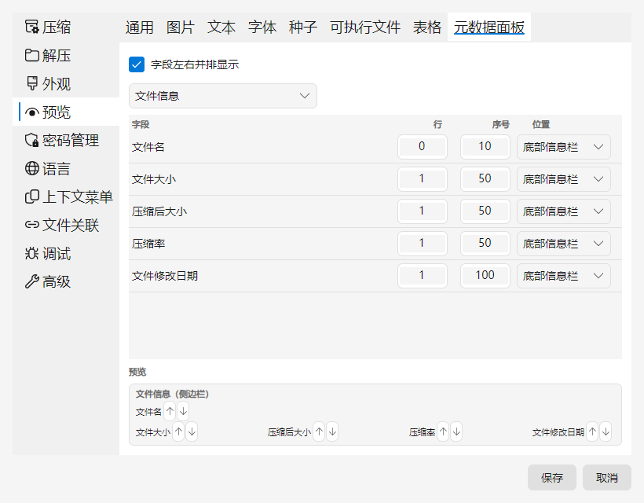
- 自定义文件选择器 — 多选累积、目录树、收藏/历史/窗口速选、盘符下拉、文件类型筛选，替代系统对话框
- Custom file picker — multi-select accumulation, directory tree, favorites/history/windows quick-pick, drive dropdown, file type filter; replaces system dialogs
- 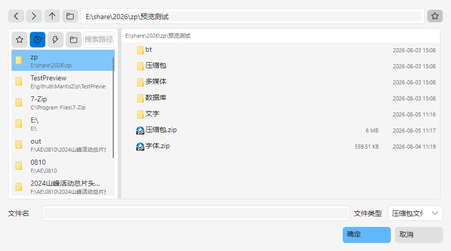
- 可排序默认路径优先级 — context/explorer/recent/custom 四来源可排序，支持手动路径与桌面兜底
- Sortable default path priority — context/explorer/recent/custom sources sortable, with manual path and desktop fallback
- 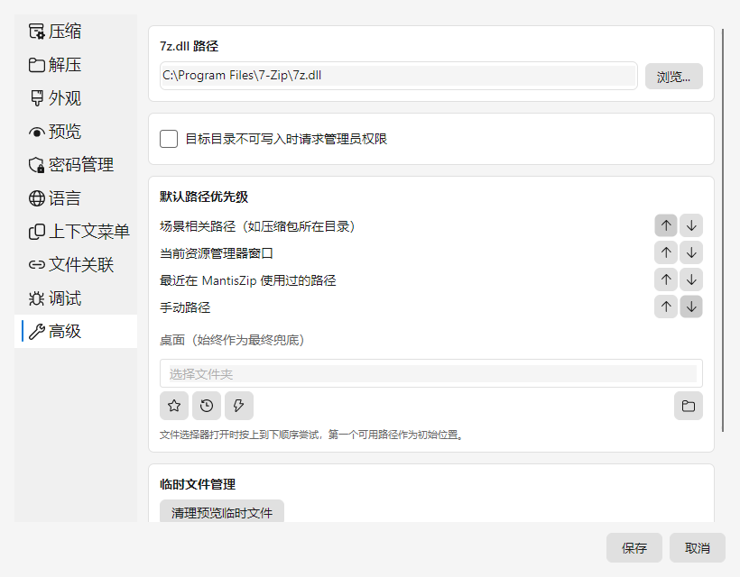
- 拖拽直接解压新模型 — 拖出压缩包到 Explorer 目标目录实时解压，Win32 覆层三色状态指示 + 动态光标 + Esc 取消
- New drag-to-extract model — drag archive onto an Explorer target directory to extract in real time; Win32 overlay three-color state indicator + dynamic cursor + Esc cancel
- 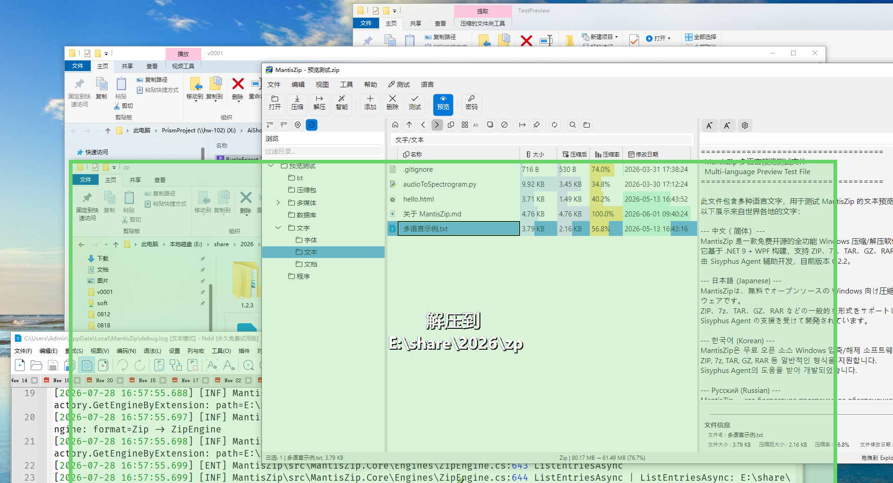
- 新增目录树自动展开开关 — 自动展开到当前浏览位置
- Added auto-expand directory tree toggle — automatically expands to the currently browsed location
- 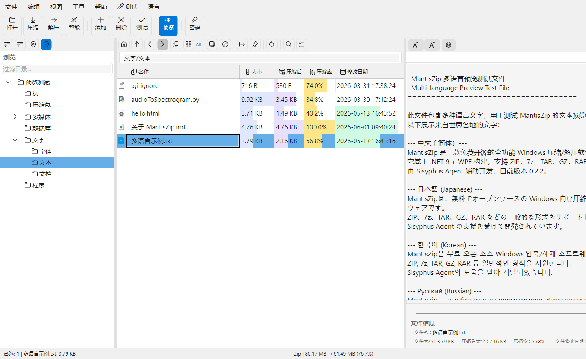
- 拖拽添加到压缩包 — 从资源管理器拖文件/文件夹到 MantisZip 窗口即可添加到当前目录，拖入压缩包一键切换打开，窗口内绿色覆层即时提示可添加状态
- Added drag-to-add — drag files/folders from Explorer onto the MantisZip window to add them to the current folder; dropping an archive switches to it; a green in-window overlay instantly shows addable state
- 
- 文件列表列排序增强 — 点击列头三态循环（升序→降序→恢复原始顺序）+ 列头箭头指示 + 排序状态跨会话持久化
- Enhanced file list column sorting — clicking a column header cycles ascending → descending → original order, with header arrow indicator and cross-session sort persistence
- 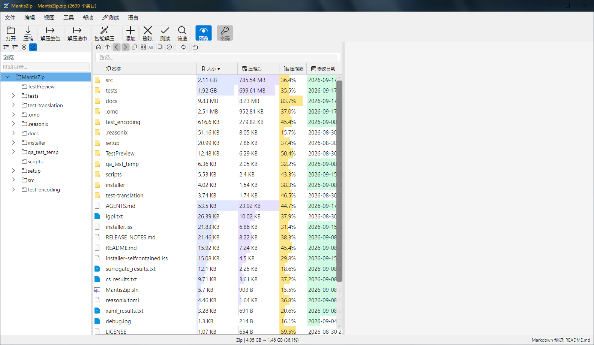
- 目录行聚合显示 — 目录行大小/日期/压缩后大小由子树聚合得出（大小=子树文件之和、日期=最新文件时间），一眼看清目录内容规模
- Directory row aggregation — directory rows show aggregated size/date/compressed size from their subtree (size = sum of contained files, date = newest file), so folder sizes are visible at a glance
- 保存布局 — 拖动列宽/预览面板调整后可一键保存，「查看」菜单保留布局项，下次启动自动恢复
- Save layout — after resizing columns or the preview panel, save once and it restores automatically on next launch (View menu → "Save Layout")
- 

## v0.4.5

### 文件说明 / File Description

MantisZip-0.4.5-Setup-WebSetup.exe 是需要联网才能安装的。MantisZip-0.4.5-Setup-Offline.exe 是离线安装包。MantisZip-0.4.5-Portable.zip 是便携版，解压即用。

MantisZip-0.4.5-Setup-WebSetup.exe requires internet during installation. MantisZip-0.4.5-Setup-Offline.exe is a fully offline installer. MantisZip-0.4.5-Portable.zip is the portable version, extract and run.

### 更新内容 / Changelog

- 完成 [压缩选项增强](.omo/plans/compression-options-enhancement.md) 计划 — 7z 字典大小、固实块、Word Size、匹配器可配置；ZIP 压缩方法（Deflate/Deflate64/BZip2/LZMA/PPMd/Store）可配置；ZIP/7z 加密方式可配置，7z 支持加密文件名开关
- Completed [Compression Options Enhancement](.omo/plans/compression-options-enhancement.md) plan — configurable 7z dictionary size, solid block, word size, match finder; configurable ZIP compression method (Deflate/Deflate64/BZip2/LZMA/PPMd/Store); configurable ZIP/7z encryption method, 7z encrypt headers toggle
- 
- 完成 [文件过滤功能](.omo/plans/file-filter-feature.md) 计划 — 支持按扩展名、文件名、尺寸、日期过滤，可保存为命名预设
- Completed [File Filter](.omo/plans/file-filter-feature.md) plan — filter by extension, filename, size, or date range; supports named presets persisted in settings
- 
- 新增便携模式，CI 自动生成 Portable 压缩包
- Added portable mode; CI automatically generates Portable zip
- 解压路径统一 — `ExtractSelectedAsync` 改为调用引擎 `ExtractEntriesAsync`
- Unified extract path — `ExtractSelectedAsync` now delegates to engine `ExtractEntriesAsync`
- 视图菜单新增"隐藏预览信息"开关，预览信息面板可独立显隐控制
- Added "Hide Preview Info" toggle in View menu for independent control of preview info panel visibility
- 
- 可配置双击行为 — 设置窗口新增"双击压缩包"选项（打开/原地解压/智能原地解压/打开解压窗口），`--open` CLI 按配置路由 (#16)
- Configurable double-click behavior — new "double-click archive" option in Settings (open/extract-here/smart-extract/extract-dialog); `--open` CLI routes accordingly
- 
- 解压后自动删除原压缩包 — 新增"解压完成后将原压缩包移到回收站"选项，(#16)
- Auto-delete archive after extraction — new option to move original archive to Recycle Bin
- 
- 文件冲突窗口增加“暂停”和“取消”按钮。(#25)
- Add ‘Pause’ and ‘Cancel’ buttons to the file conflict window.
- 
- 修复安装后会导致别的软件安装完启动时错误本软件的问题。
- Fixed issue where installing other software could incorrectly route their startup to MantisZip.

## v0.4.4

### 文件说明 / File Description

MantisZip-0.4.4-Setup-WebSetup.exe 是需要联网才能安装的。MantisZip-0.4.4-Setup-Offline.exe 是离线安装包。

MantisZip-0.4.4-Setup-WebSetup.exe requires internet during installation. MantisZip-0.4.4-Setup-Offline.exe is a fully offline installer.

### 更新内容 / Changelog

- 完成 [魔数检测预览系统](.omo/plans/preview-magic-detection.md) 计划 — 通过文件内容（魔数）识别真实格式预览，不再依赖扩展名
- Completed [Magic Detection Preview System](.omo/plans/preview-magic-detection.md) plan — identifies file formats by content (magic bytes) for preview, no longer relies on file extensions
- 
- 魔数检测结果与扩展名不一致时，可在工具栏切换"按扩展名/按魔数"预览
- When magic detection conflicts with the file extension, toggle between "by extension / by magic number" preview in the toolbar
- 
- 完成压缩包路径处理一站式重构 `ArchivePath`，统一了散落在各处的路径处理代码，并修复了加密压缩解压的多处 bug
- Completed one-stop archive path refactoring (`ArchivePath`), unified scattered path handling code, and fixed multiple encryption-related compression/extraction bugs
- 密码流程统一重构 — 统一密码入口 `ResolvePasswordAsync`，调用方大幅简化
- Unified password flow refactoring — centralized password entry via `ResolvePasswordAsync`, significantly simplified callers
- 双击文件用系统默认程序打开（可在设置中调整阈值）
- Double-click files to open with system default program (threshold configurable in settings)
- 安装包增强，文件名重命名：`WebSetup`（联网）/ `Offline`（离线），联网安装包可自动下载所需依赖
- Installer improvements: renamed to `WebSetup` (online) / `Offline` (offline); online installer automatically downloads required dependencies
- 离线安装包新增自包含模式，无需安装 .NET Runtime
- Offline installer now includes self-contained mode, no .NET Runtime installation required

## v0.4.3

### 文件说明 / File Description

MantisZip-0.4.3-Setup-NoDotNet.exe 是需要安装 dotnet runtime 才能运行的。MantisZip-0.4.3-Setup.exe 是自包含 dotnet runtime 的。

MantisZip-0.4.3-Setup-NoDotNet.exe requires the .NET runtime to be installed. MantisZip-0.4.3-Setup.exe is self-contained with the .NET runtime.

**如果你不明白上面那句话是什么意思，请下载 MantisZip-0.4.3-Setup.exe。**

**If you don't understand what the above means, please download MantisZip-0.4.3-Setup.exe.**

### 更新内容 / Changelog

- 完成 [快速路径选择](.omo/plans/quickpath-unified.md) 计划。
- Completed [Quick Path Selection](.omo/plans/quickpath-unified.md) plan.
- 快速路径选择，在"浏览"按钮旁边加上三个用于切换路径的按钮。（灵感来自软件 Listary）
- Quick Path Selection: added three buttons next to the "Browse" button for switching paths. (Inspired by Listary)
- 
- 可以把常用路径加入书签，在"书签"按钮弹出菜单里面选择并切换。
- Frequently used paths can be bookmarked and selected via the "Bookmark" button popup menu for quick switching.
- 
- 可以在书签管理器里面管理书签。
- Bookmarks can be managed in the Bookmark Manager.
- 
- "历史"按钮，弹出菜单里面会显示最近的用到的目录并切换。
- The "History" button shows recently used directories in a popup menu for quick switching.
- 
- "切换"按钮，弹出菜单里面会显示此时打开的资源管理器目录并切换。
- The "Switch" button shows currently open Explorer directories in a popup menu for quick switching.
- 

## v0.4.2

### 文件说明 / File Description

MantisZip-0.4.2-Setup-NoDotNet.exe 是需要安装 dotnet runtime 才能运行的。MantisZip-0.4.2-Setup.exe 是自包含 dotnet runtime 的。

MantisZip-0.4.2-Setup-NoDotNet.exe requires the .NET runtime to be installed. MantisZip-0.4.2-Setup.exe is self-contained with the .NET runtime.

**如果你不明白上面那句话是什么意思，请下载 MantisZip-0.4.2-Setup.exe。**

**If you don't understand what the above means, please download MantisZip-0.4.2-Setup.exe.**

### 更新内容 / Changelog

- 修复上下文动态菜单有时会闪烁的问题。
- Fixed issue where dynamic context menus sometimes flickered.
- 修复安装时选择语言和外观无效的问题（感谢 Peiming_The_Blank）。
- Fixed issue where language and appearance selection during installation was ineffective (thanks to Peiming_The_Blank).
- 完成计划 [zip 复制模式](.omo/plans/zipengine-sharpcompress-migration.md)，添加删除文件不再是"解压缩→重新压缩"，而改成了"复制模式"。速度极大提升。
- Completed plan: [ZIP copy mode](.omo/plans/zipengine-sharpcompress-migration.md). Adding/deleting files now uses "copy mode" instead of "decompress → recompress". Significantly faster.
- 完成计划 [权限提升](.omo/plans/uac-elevation-permission.md)，当压缩解压到无权限的目录时，会有正确的处理（感谢 xieyilin.main）。
- Completed plan: [UAC elevation](.omo/plans/uac-elevation-permission.md). Proper handling when compressing/extracting to directories without permission (thanks to xieyilin.main).
- 
- 
- 

## v0.4.1

### 文件说明 / File Description

MantisZip-0.4.1-Setup-NoDotNet.exe 是需要安装 dotnet runtime 才能运行的。MantisZip-0.4.1-Setup.exe 是自包含 dotnet runtime 的。

MantisZip-0.4.1-Setup-NoDotNet.exe requires the .NET runtime to be installed. MantisZip-0.4.1-Setup.exe is self-contained with the .NET runtime.

**如果你不明白上面那句话是什么意思，请下载 MantisZip-0.4.0-Setup.exe。**

**If you don't understand what the above means, please download MantisZip-0.4.0-Setup.exe.**

### 更新内容 / Changelog

- 修复上下文动态菜单有时不能起效的问题，并增加了不使用动态菜单的选项
- Fixed issue where dynamic context menus sometimes didn't work, and added an option to disable dynamic menus
- 
- 文件列表增加回到父目录的行
- Added a "go to parent directory" row in the file list
- 
- 文件列表目录回车改成进入该目录
- Changed Enter key on directories in the file list to navigate into that directory

## v0.4.0

### 文件说明 / File Description

MantisZip-0.4.0-Setup.exe 是需要安装 dotnet runtime 才能运行的。MantisZip-0.4.0-Setup-SelfContained.exe 是自包含 dotnet runtime 的。

MantisZip-0.4.0-Setup.exe requires the .NET runtime to be installed. MantisZip-0.4.0-Setup-SelfContained.exe is self-contained with the .NET runtime.

**如果你不明白上面那句话是什么意思，请下载 MantisZip-0.4.0-Setup-SelfContained.exe。**
**If you don't understand what the above means, please download MantisZip-0.4.0-Setup-SelfContained.exe.**

### 软件第一个版本 / First Release

- 软件功能基本完整，测试基本完成。
- Core features are complete and testing is largely finalized.
- 
- 

## v0.0.0

# Release Notes / 发布说明

> **每次发布前在此文件顶部写入本次更新的内容，CI 会自动将其作为 GitHub Release 的说明文字。**
> **Write the update notes at the top of this file before each release. CI will automatically use them as the GitHub Release description.**
>
> 保留之前版本的记录在下面供参考，上面最新内容会被 CI 读取。
> Keep records of previous versions below for reference. The latest content at the top will be read by CI.
