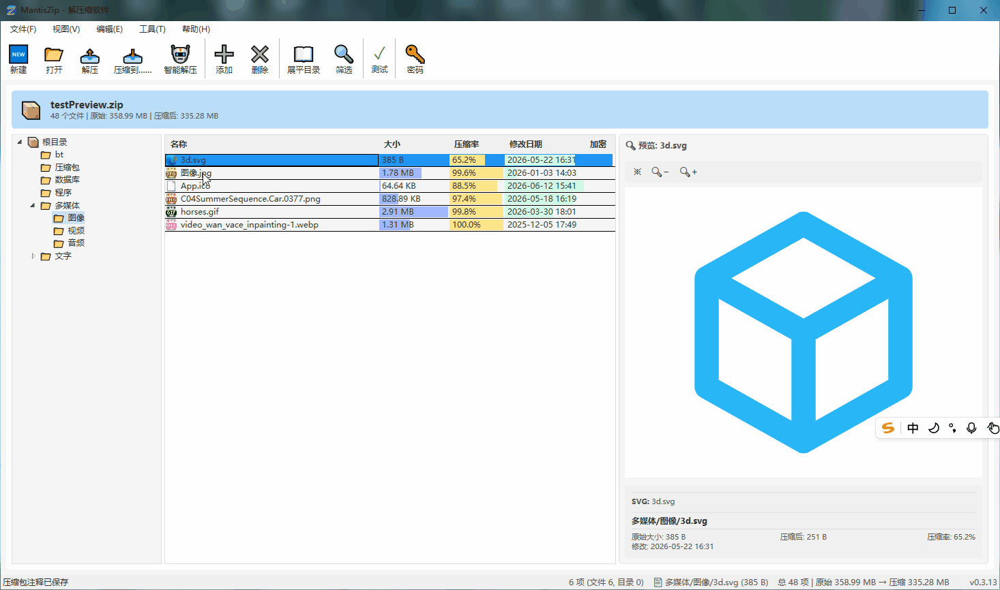
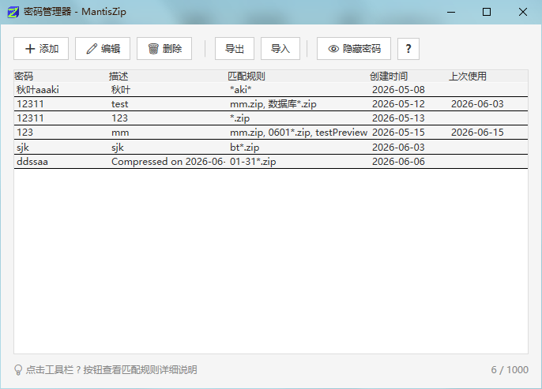

## v0.4.0

### 文件说明
MantisZip-0.4.0-Setup.exe 是自包含 dotnet runtime 的。 MantisZip-0.4.0-Setup-NoDotNet.exe 是需要安装 dotnet runtime 才能运行的。

**如果你不明白上面那句话是什么意思，请下载 MantisZip-0.4.0-Setup.exe。**

### 软件第一个版本：
- 软件功能基本完整，测试基本完成。
- 
- 

## v0

# Release Notes

> **每次发布前在此文件顶部写入本次更新的内容，CI 会自动将其作为 GitHub Release 的说明文字。**
> 保留之前版本的记录在下面供参考，上面的最新内容会被 CI 读取。