## v0.5.2

### 文件说明 / File Description

MantisZip-0.5.2-Setup-WebSetup.exe 是需要联网才能安装的。MantisZip-0.5.2-Setup-Offline.exe 是离线安装包。MantisZip-0.5.2-Portable.zip 是便携版，解压即用。MantisZip-0.5.2-Portable-Web.zip 是无依赖便携版，需要电脑安装有 .NET 10 运行时才能正常使用。

MantisZip-0.5.2-Setup-WebSetup.exe requires internet during installation. MantisZip-0.5.2-Setup-Offline.exe is a fully offline installer. MantisZip-0.5.2-Portable.zip is the portable version, extract and run. MantisZip-0.5.2-Portable-Web.zip is a dependency-free portable version that requires the .NET 10 runtime to be installed on your computer.

### 更新内容 / Changelog

**新预览格式 / New Preview Formats**

- 音频预览新增 **MP3 / FLAC 内嵌封面显示** — 直接读取 ID3 标签（MP3）与 PICTURE 块（FLAC）中的内嵌封面图并居中展示；无封面时回退显示标题/艺术家大字
- Added **embedded cover art display for MP3 / FLAC audio preview** — reads the embedded cover image from the ID3 tag (MP3) and the PICTURE block (FLAC) and shows it centered; falls back to a large title/artist text when no cover is present

**交互 / Interactions**

- 压缩端新增**「文件冲突默认策略」**（对齐解压端）— 可选每次询问 / 覆盖 / 追加 / 自动重命名 / 跳过，设置窗口与压缩对话框均可配置；非「每次询问」时直接按策略执行、不再弹窗
- Added a **default file-conflict strategy for compression** (matching the extract side) — choose ask-each-time / overwrite / add / auto-rename / skip, configurable in both Settings and the compress dialog; anything other than "ask each time" is applied directly without a prompt
- 解压设置窗口新增**「解压后将原压缩包移到回收站」勾选项** — 默认读取全局设置，勾选仅本次解压生效、不写回设置
- The extract settings dialog gained a **"move the original archive to the Recycle Bin after extraction" checkbox** — defaults to the global setting; the choice applies to this extraction only and is not written back

**修复 / Fixes**

- 修复**预览窗格宽度缩水** — 拖动分隔条调整预览面板尺寸后，重新打开应用时面板会缩回最小；原因是尺寸记忆只记录了固定像素值，未保存过布局时拖出的是比例（Star）尺寸而被丢弃。现同时记录像素与比例两种尺寸并持久化，恢复后比例尺寸随窗口缩放、像素尺寸保持固定
- Fixed **the preview pane shrinking to its minimum width** — after resizing the preview panel by dragging the splitter, reopening the app collapsed it back to the minimum; the cause was that the size memory only stored fixed pixel values and discarded the proportional (Star) size produced when no layout had been saved yet. It now records and persists both pixel and proportional sizes; on restore, proportional sizes scale with the window while pixel sizes stay fixed
- 修复**加密压缩包（RAR/7z）「测试压缩包」静默失败** — 此前加密包测试只从会话缓存读密码，无会话密码时测试接口快速返回失败，状态栏仅显示「测试失败」且无任何提示。现测试前先对齐解压/打开流程解析密码：会话缓存 → 密码库自动匹配 → 密码对话框（含快速验证，错密码循环重试）；取消时提示「已取消 - 需要密码」并中止，不再假失败
- Fixed **silent "Test archive" failure on encrypted RAR/7z archives** — the test previously read the password only from the session cache; with no session password the test API quickly returned false and the status bar showed only "test failed" with no prompt. The test now resolves the password exactly like open/extract first: session cache → password library auto-match → password dialog (with quick verification and retry on wrong password); cancelling shows "Cancelled - password required" and aborts instead of falsely failing
- 修复**测试压缩包时进度条不动** — 底层 `TestArchiveAsync` 此前在 `Check()`（=7z.dll 整包提取校验语义）阶段不订阅任何进度事件，同时校验完后还冗余地对每个条目再解压一次（约 2 倍工作量）。现改为消费校验阶段的 `FileExtractionFinished` 事件逐条目上报进度，并删除冗余的逐条目二次解压；实测 130MB 未加密 RAR 测试由约 1.4s 降至约 0.8s，且加密/未加密 RAR、7z 测试均实时显示进度
- Fixed **the progress bar not moving during "Test archive"** — `TestArchiveAsync` previously subscribed to no progress events during `Check()` (the 7z.dll full-extraction verify), and afterwards redundantly extracted every entry again (~2x the work). It now reports per-entry progress from the `FileExtractionFinished` events raised during verification and drops the redundant per-entry re-extraction; measured 130MB unencrypted RAR test dropped from ~1.4s to ~0.8s, and both encrypted and unencrypted RAR and 7z tests now show live progress

## v0.5.1

### 文件说明 / File Description

MantisZip-0.5.1-Setup-WebSetup.exe 是需要联网才能安装的。MantisZip-0.5.1-Setup-Offline.exe 是离线安装包。MantisZip-0.5.1-Portable.zip 是便携版，解压即用。MantisZip-0.5.1-Portable-Web.zip 是无依赖便携版，需要电脑安装有 .NET 10 运行时才能正常使用。

MantisZip-0.5.1-Setup-WebSetup.exe requires internet during installation. MantisZip-0.5.1-Setup-Offline.exe is a fully offline installer. MantisZip-0.5.1-Portable.zip is the portable version, extract and run. MantisZip-0.5.1-Portable-Web.zip is a dependency-free portable version that requires the .NET 10 runtime to be installed on your computer.

### 更新内容 / Changelog

**新预览格式 / New Preview Formats**

- 新增 **APNG 动画预览** — 通过 `acTL` 块魔数检测识别，与 GIF 统一走动画通道，支持逐帧播放与透明背景棋盘格
- Added **APNG animated preview** — detected via the `acTL` chunk magic number, handled uniformly with GIF in the animation path; supports frame-by-frame playback and the transparency checkerboard
- 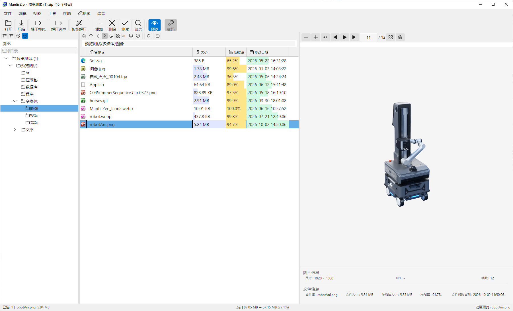
- 新增 **TGA 预览** — 使用 ImageSharp 解码，并修复了红蓝通道交换导致颜色错误的问题
- Added **TGA preview** — decoded via ImageSharp, with a fix for swapped red/blue channels that caused incorrect colors
- 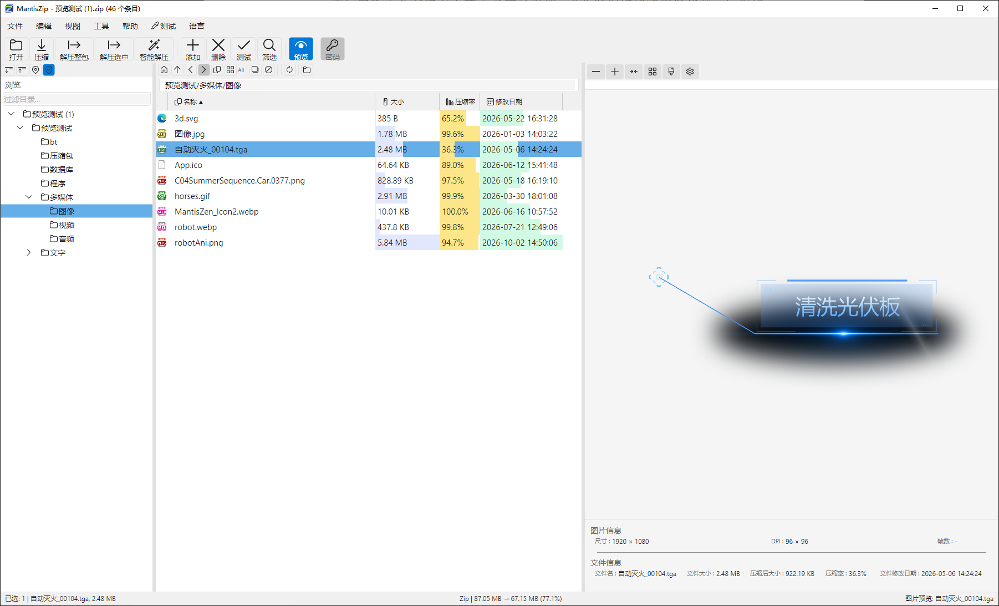

**性能 / Performance**

- **ZIP 并行解压** — 多实例并行 + 批次复用（Round-Robin 分批 + 实例复用），解压缓冲区 256KB → 4MB
- **Parallel ZIP extraction** — multi-instance parallelism with batch reuse (Round-Robin batching + instance reuse); extraction buffer raised from 256KB to 4MB
- 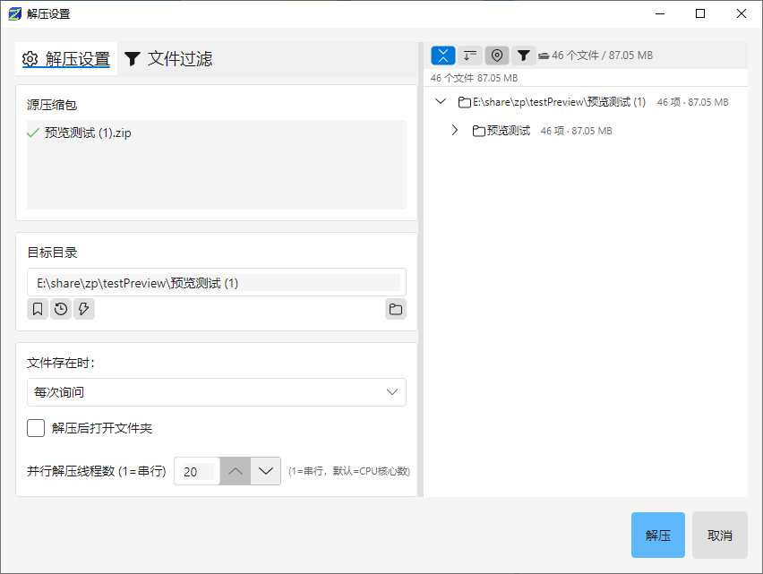
- **7z 多线程压缩（`mt=on`）** — 实测 100 × 1MB 随机数据加速 **4.63x**，压缩对话框与设置窗口双入口开关
- **7z multithreaded compression (`mt=on`)** — measured 4.63x speedup on 100 × 1MB random data; toggles available in both the compress dialog and Settings
- 新增**并行解压线程数**设置项（1–16，默认随 CPU 核数，`1` 为串行回退）
- Added a **parallel extraction thread count** setting (1–16, defaults to CPU core count; `1` falls back to serial)

**交互 / Interactions**

- 解压目标目录选择器新增**左下通用参数区**，首个参数项为**「保留完整路径」**开关 — 修复「预览所见 ≠ 实际落盘」：此前对话框只返回路径，调用方拿到路径后回头独立读设置，用户在预览阶段无法表达意图；现改为强类型 `ExtractPickResult` 贯穿两个有对话框的消费点
- The extract folder picker gained a **generic options region** at the bottom left, whose first option is a **"Preserve full path"** toggle — fixing the "preview ≠ actual extraction" mismatch: the dialog previously returned only a path and callers re-read the setting afterwards, so the user could not express intent while previewing; a strongly-typed `ExtractPickResult` now carries it through both dialog-driven call sites
- 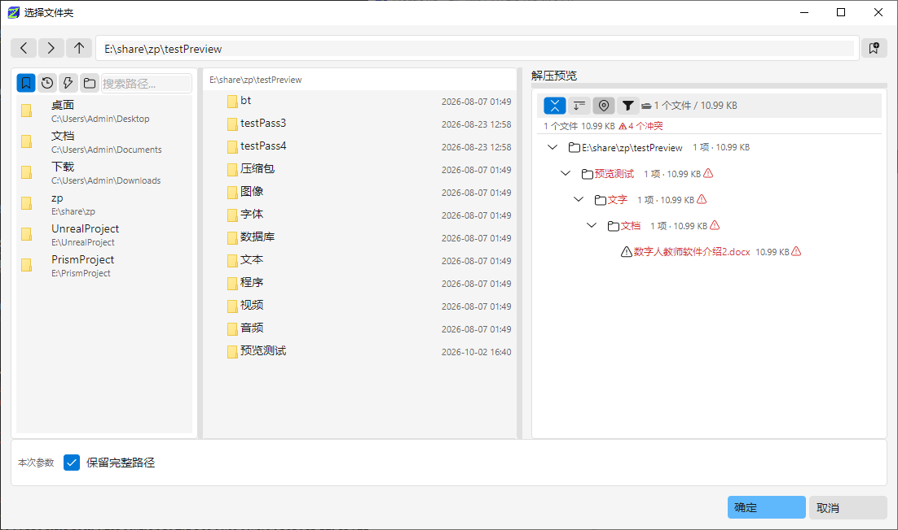
- 自定义文件选择器新增**自定义文件类型**与**建议文件名**，添加文件支持选择文件夹，密码管理器导入导出改用自定义选择器
- The custom file picker now supports **custom file types** and **suggested file names**; adding files accepts folders, and password manager import/export moved to the custom picker
- 拖拽解压目标检测失败时改用带解压预览的自定义对话框兜底
- Drag extraction now falls back to the custom dialog with extraction preview when target detection fails

**新增语言 / New Language**

- 新增**繁体中文（zh-TW）** 语言支持
- Added **Traditional Chinese (zh-TW)** language support

**修复 / Fixes**

- 修复**拖拽添加中文文件到压缩包后文件名乱码** — 底层 ZIP 重写器写入 UTF-8 文件名时未置 UTF-8 标志（bit 11），违反 ZIP 规范（APPNOTE 6.4.4），导致 7-Zip / WinRAR / 资源管理器 / unzip 等外部工具按 CP437 解码显示乱码。因应用内读取有编码回退启发式兜底，故仅在外部工具中显现
- Fixed **garbled file names when drag-and-dropping Chinese-named files into an archive** — the ZIP rewriter wrote UTF-8 file names without the UTF-8 flag (bit 11), violating the ZIP spec (APPNOTE 6.4.4), so external tools (7-Zip / WinRAR / Explorer / unzip) decoded them as CP437 and showed mojibake. The bug stayed invisible inside the app because its reader falls back with an encoding heuristic
- 修复**删除压缩包内文件时损坏其它条目** — 重写器此前固定按 UTF-8 解码文件名、再用另一种编码写回，「解码→重编码」往返会破坏非 UTF-8 编码的条目；现在既有条目的文件名原始字节被原样保留，删除某个文件不再影响无关文件
- Fixed **deleting one file could corrupt unrelated entries** — the rewriter previously decoded every file name as UTF-8 and re-encoded it with a different encoding; that decode→re-encode round trip mangled non-UTF-8 entries. Original file name bytes are now preserved verbatim, so deleting a file never touches the others
- 修复**添加/删除文件时忽略「ZIP 文件名编码」设置** — 引擎此前靠包内标志位猜测编码，用户设置不生效；现与压缩对话框一致，按设置写入
- Fixed **the "ZIP file name encoding" setting being ignored when adding or deleting files** — the engine used to guess the encoding from archive flags instead of the user's setting; it now honours the setting, matching the compress dialog
- 批量修复 7 项设置读取失效 — 压缩默认值、解压后删包、启动清理临时目录、提权开关等设置项改动后不生效
- Fixed 7 settings that failed to take effect — compression defaults, delete-archive-after-extract, clean-temp-on-startup, elevation toggle, and others
- 修复**点击压缩包内任意条目（含目录）后应用无提示直接退出** — 预览面板把 WebView 常驻在活动视觉树里，导致**任何**预览（目录、不支持预览的格式等）都会去初始化 WebView2；而 WebView2 初始化失败的异步异常是在 UI 线程上抛出的，栈上早已跳出预览调用，程序又没有订阅未处理异常，于是直接终止进程（表现为 `E_ACCESSDENIED` 或 `RPC_E_CHANGED_MODE`）。现改为**仅预览 HTML 时才惰性创建** WebView，目录条目直接提示「不支持预览」，并加入未处理异常守卫 —— WebView2 不可用时自动降级为原生控件渲染，而不是崩溃。**无需安装或下载任何额外组件**
- Fixed **the app exiting silently when clicking any entry in an archive (including folders)** — the preview panel kept a WebView permanently in the live visual tree, so *any* preview (folders, unsupported formats, etc.) tried to initialize WebView2; that initialization failure raises an asynchronous exception on the UI thread, by which point the stack has already unwound past the preview call and nothing was subscribed to unhandled exceptions, so the process was terminated (surfacing as `E_ACCESSDENIED` or `RPC_E_CHANGED_MODE`). The WebView is now created **lazily, only for HTML previews**, folder entries short-circuit to an "unsupported preview" notice, and an unhandled-exception guard makes an unavailable WebView2 fall back to native control rendering instead of crashing. **No extra component needs to be installed or downloaded**

**依赖升级 / Dependency Upgrades**

- Avalonia 12.0.4 → 12.1.2 全栈升级，NuGet 核心依赖全面升级
- Upgraded Avalonia from 12.0.4 to 12.1.2 across the stack, plus a broad upgrade of core NuGet dependencies

## v0.5.0

### 版本介绍 / Version Introduction

这是 MantisZip 的一次**大版本更新**，核心框架从 WPF 完全迁移到 Avalonia，界面全面重构，安装包大幅精简。主要更新内容：

This is a **major version update** of MantisZip: the core framework has fully migrated from WPF to Avalonia, the UI has been completely rebuilt, and the installer has been significantly slimmed down. Key highlights:

**框架与架构 / Framework & Architecture**
- **核心框架从 WPF 迁移到 Avalonia**（.NET 10），界面全面重构，WPF 版已完全删除
- **Core framework migrated from WPF to Avalonia** (.NET 10), UI completely rebuilt; the WPF version has been fully removed
- **去除 WebView2 依赖** — HTML/Markdown/PDF/SVG 全部改为原生渲染，安装包大幅精简，安装不再需要额外运行时
- **WebView2 dependency removed** — HTML/Markdown/PDF/SVG all rendered natively, installer significantly slimmed down, no extra runtime needed during installation
- **自实现 GIF 解码器与字体预览引擎** — GIF 动画不再依赖 WpfAnimatedGif；字体预览改用 HarfBuzzSharp+SkiaSharp，支持自动连字检测
- **Self-implemented GIF decoder and font preview engine** — GIF animation no longer relies on WpfAnimatedGif; font preview uses HarfBuzzSharp+SkiaSharp rendering with automatic ligature detection
- 新增 **Animated WebP** 动画预览，与 GIF 统一处理
- Added **Animated WebP** preview, handled uniformly with GIF

**预览能力 / Preview Capabilities**
- 新增 **Office 文档内容预览** — DOCX 大纲导航+全文+表格、XLSX DataGrid 表格、PPTX 原始坐标定位预览（WPF 版仅显示元数据）
- Added **Office document content preview** — DOCX outline navigation + full text + tables, XLSX DataGrid tables, PPTX original-coordinate positioned preview (WPF version only showed metadata)
- **元数据信息面板可配置** — 字段排布自定义，独立配置文件持久化
- **Configurable metadata info panel** — custom field layout, persisted in a separate config file
- 新增 **目标目录树预览** 控件，在压缩与解压窗口可查看将要生成的文件结构，如果有文件冲突会高亮提示。
- Added **result preview tree** control — the compress/extract dialogs show the file structure that will be produced, with conflicts highlighted.

**交互 / Interactions**
- **拖拽双向** — 从窗口拖文件到资源管理器**实时解压**（Win32 覆层三色指示+动态光标+Esc 取消）；从资源管理器拖文件**添加到压缩包**（绿色覆层即时提示）
- **Bidirectional drag & drop** — drag files from the window to Explorer for **real-time extraction** (Win32 overlay three-color indicator + dynamic cursor + Esc cancel); drag files from Explorer to **add them to the archive** (green overlay instant feedback)
- **自定义文件选择器** — 多选累积、目录树、收藏/历史/窗口速选、盘符下拉、文件类型筛选，替代系统对话框
- **Custom file picker** — multi-select accumulation, directory tree, favorites/history/windows quick-pick, drive dropdown, file type filter; replaces system dialogs

**外观 / Appearance**
- **紧凑度模式** — Compact/Normal/Loose 三档间距与控件高度，运行时切换无需重启
- **Compactness mode** — Compact/Normal/Loose spacing and control heights, switchable at runtime without restart
- **主题三态化** — 跟随系统 / 亮色 / 暗色（WPF 版仅亮/暗），新增全局界面字体设置
- **Theme tri-state** — System / Light / Dark (WPF version only had Light/Dark); new global UI font setting
- 新增**目录树自动展开**开关 — 自动展开到当前浏览位置
- Added **auto-expand directory tree** toggle — automatically expands to the currently browsed location

### 文件说明 / File Description

- MantisZip-0.5.0-Setup-WebSetup.exe 是需要联网才能安装的。
- MantisZip-0.5.0-Setup-Offline.exe 是离线安装包。
- MantisZip-0.5.0-Portable.zip 是便携版，解压即用。
- MantisZip-0.5.0-Portable-Web.zip 是无依赖便携版，需要电脑安装有 .NET 10 运行时才能正常使用。

- MantisZip-0.5.0-Setup-WebSetup.exe requires internet during installation. 
- MantisZip-0.5.0-Setup-Offline.exe is a fully offline installer. 
- MantisZip-0.5.0-Portable.zip is the portable version, extract and run. 
- MantisZip-0.5.0-Portable-Web.zip is a dependency-free portable version that requires the .NET 10 runtime to be installed on your computer.

### 更新内容 / Changelog

- 核心框架从 WPF 迁移到 Avalonia（.NET 10 跨平台就绪，MVVM 架构重构），WPF 版已完全删除
- Core framework migrated from WPF to Avalonia (.NET 10, cross-platform ready, MVVM architecture); the WPF version has been fully removed
- 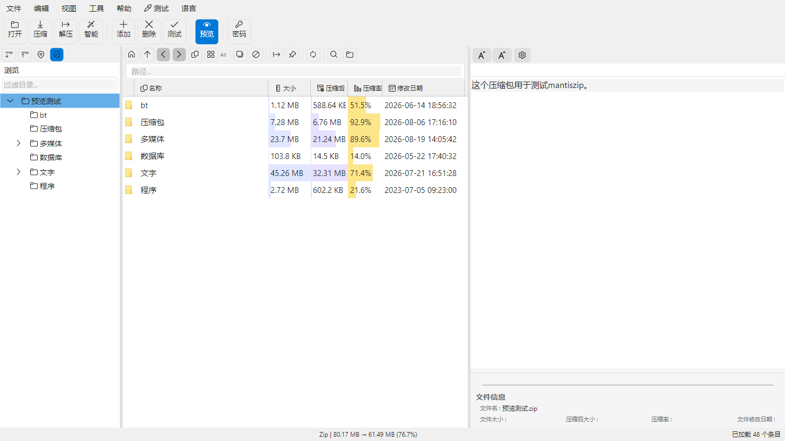
- 移除 WebView2 依赖 — HTML/Markdown 改为原生控件树渲染（ReverseMarkdown→Markdig），PDF 改为 PdfPig+SkiaSharp 逐页位图，SVG 改为 Svg.Skia 栅格化；安装不再需要 WebView2 Runtime
- Removed WebView2 dependency — HTML/Markdown rendered as native control trees (ReverseMarkdown→Markdig), PDF rendered page-by-page via PdfPig+SkiaSharp, SVG rasterized via Svg.Skia; no WebView2 Runtime required
- 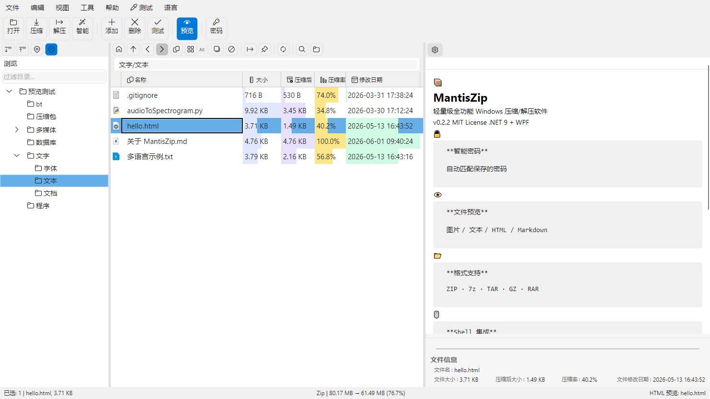
- 自实现 GIF 解码器与字体预览引擎 — GIF 动画不再依赖 WpfAnimatedGif；字体预览改用 HarfBuzzSharp+SkiaSharp 位图渲染（含自动连字检测）
- Self-implemented GIF decoder and font preview engine — GIF animation no longer relies on WpfAnimatedGif; font preview uses HarfBuzzSharp+SkiaSharp bitmap rendering (with automatic ligature detection)
- 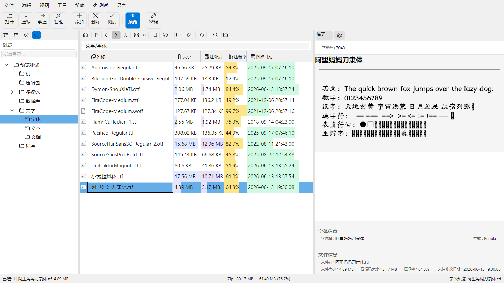
- 新增 Animated WebP 动画预览 — 与 GIF 动画统一处理，静态 WebP 保持图片预览
- Added Animated WebP preview — unified with GIF animation handling; static WebP stays as image preview
- GIF/动画透明棋盘格切换 — 🏁 按钮切换透明背景显示
- GIF/animated transparency checkerboard toggle — 🏁 button switches transparent background display
- 新增 Office 文档内容预览 — DOCX 大纲导航+全文+真 Grid 表格、XLSX DataGrid 表格、PPTX 原始坐标定位预览（WPF 版仅显示元数据）
- Added Office document content preview — DOCX outline navigation + full text + real Grid tables, XLSX DataGrid tables, PPTX original-coordinate positioned preview (WPF version only showed metadata)
- 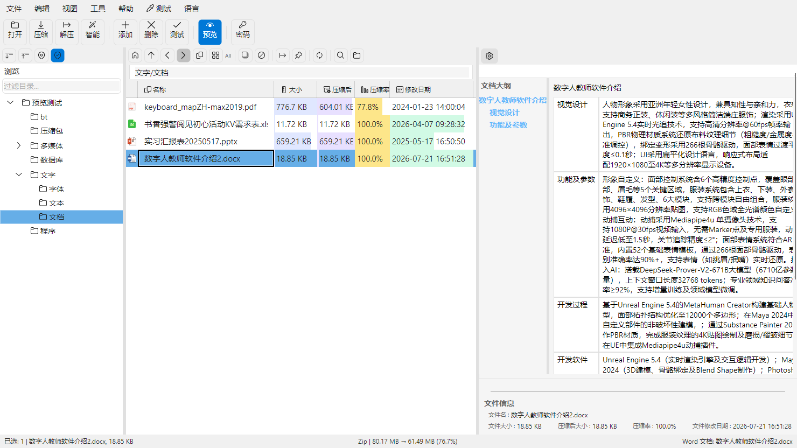
- 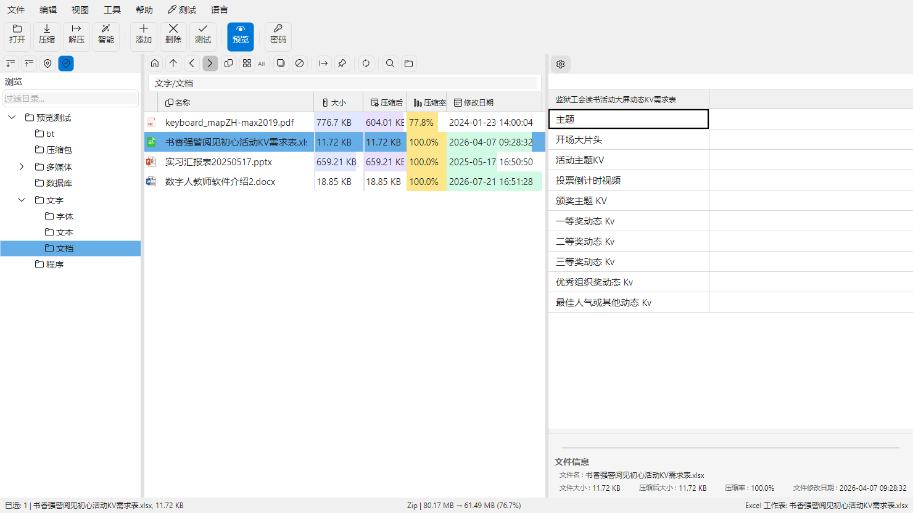
- 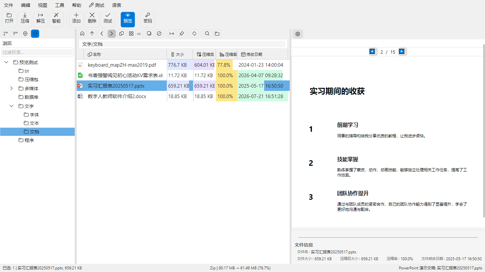
- 打开压缩包自动展示注释 — 支持 ZIP 注释（GBK/UTF-8 编码兼容）与 RAR5 注释读取
- Archive comments shown automatically on open — supports ZIP comments (GBK/UTF-8 compatible) and RAR5 comment reading
- 新增紧凑度模式 — Compact/Normal/Loose 三档间距与控件高度，运行时切换无需重启
- Added compactness mode — Compact/Normal/Loose spacing and control heights, switchable at runtime without restart
- 新增全局界面字体设置
- Added global UI font setting
- 主题三态化 — 跟随系统 / 亮色 / 暗色（WPF 版仅亮/暗）
- Theme tri-state — System / Light / Dark (WPF version only had Light/Dark)
- 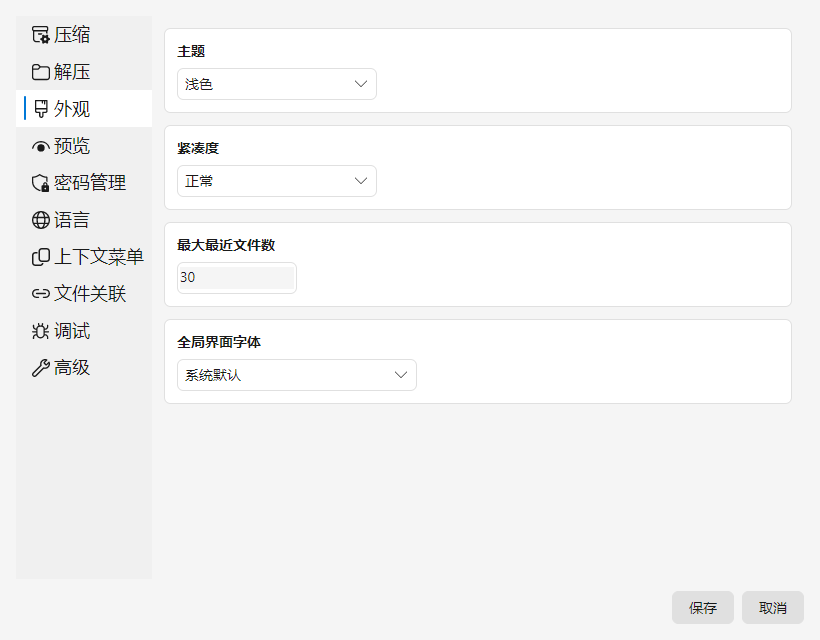
- 新增结果预览面板 — 压缩/解压设置窗口实时文件树预览，冲突高亮、过滤灰显、精简模式、异步加载
- Added result preview panel — real-time file tree preview in compress/extract dialogs with conflict highlighting, filtered ghosting, compact mode, async loading
- 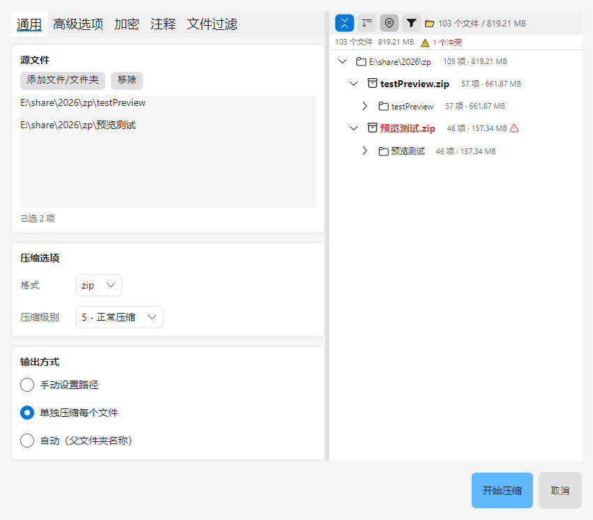
- 元数据信息面板可配置 — 字段排布自定义（信息栏/内容区顶部/隐藏+行+顺序），独立配置文件持久化
- Configurable metadata info panel — custom field layout (info panel / content top / hidden + row + order), persisted in a separate config file
- 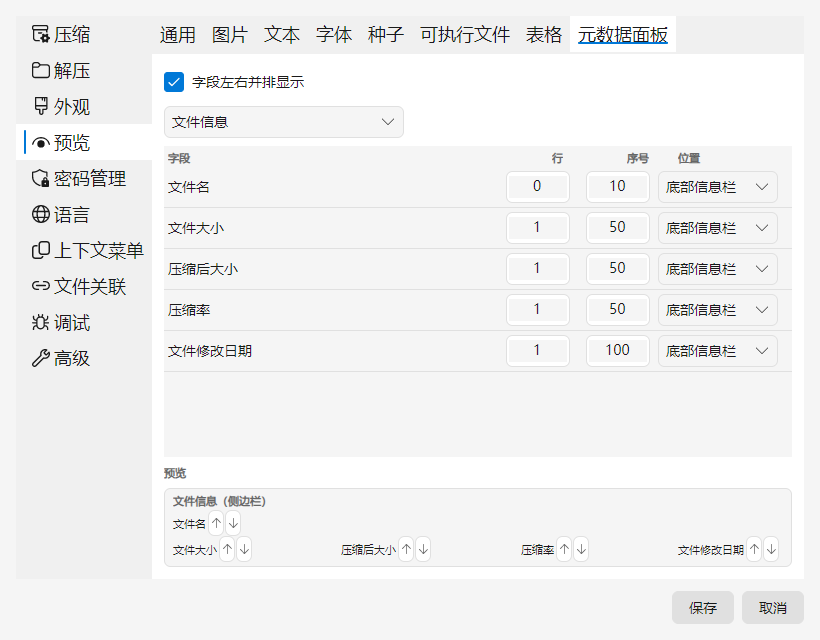
- 自定义文件选择器 — 多选累积、目录树、收藏/历史/窗口速选、盘符下拉、文件类型筛选，替代系统对话框
- Custom file picker — multi-select accumulation, directory tree, favorites/history/windows quick-pick, drive dropdown, file type filter; replaces system dialogs
- 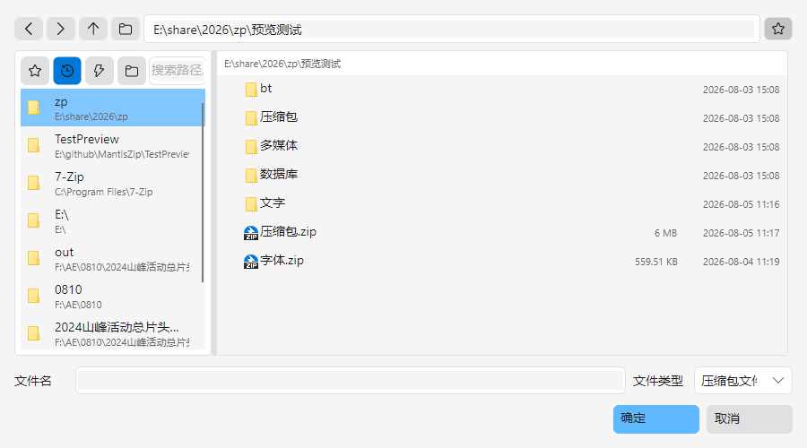
- 可排序默认路径优先级 — context/explorer/recent/custom 四来源可排序，支持手动路径与桌面兜底
- Sortable default path priority — context/explorer/recent/custom sources sortable, with manual path and desktop fallback
- 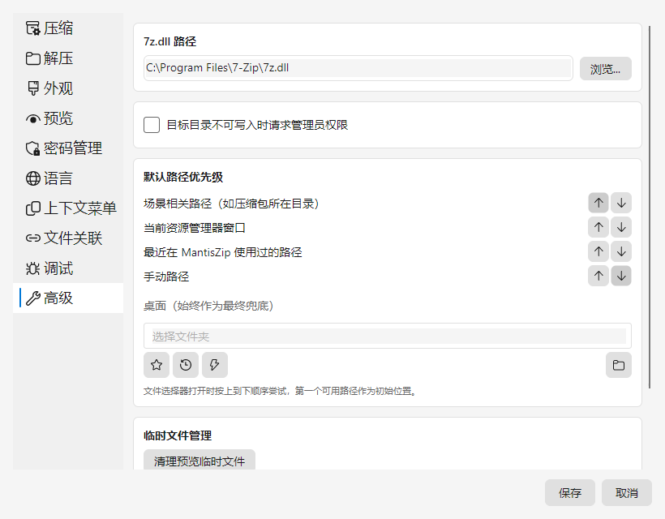
- 拖拽直接解压新模型 — 拖出压缩包到 Explorer 目标目录实时解压，Win32 覆层三色状态指示 + 动态光标 + Esc 取消
- New drag-to-extract model — drag archive onto an Explorer target directory to extract in real time; Win32 overlay three-color state indicator + dynamic cursor + Esc cancel
- 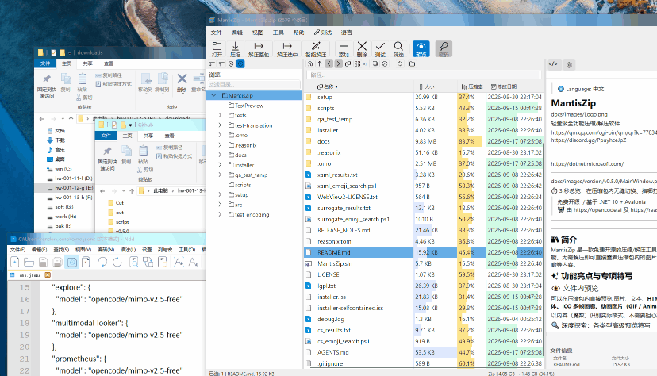
- 新增目录树自动展开开关 — 自动展开到当前浏览位置
- Added auto-expand directory tree toggle — automatically expands to the currently browsed location
- 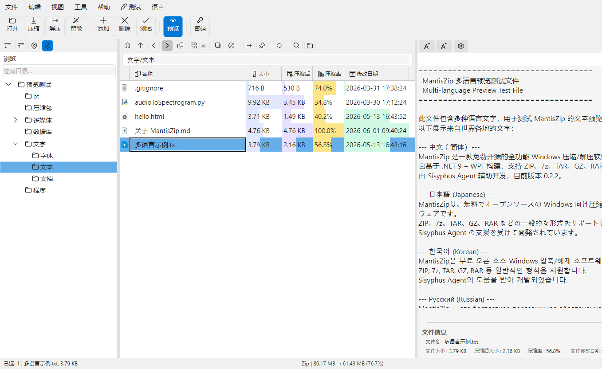
- 拖拽添加到压缩包 — 从资源管理器拖文件/文件夹到 MantisZip 窗口即可添加到当前目录，拖入压缩包一键切换打开，窗口内绿色覆层即时提示可添加状态
- Added drag-to-add — drag files/folders from Explorer onto the MantisZip window to add them to the current folder; dropping an archive switches to it; a green in-window overlay instantly shows addable state
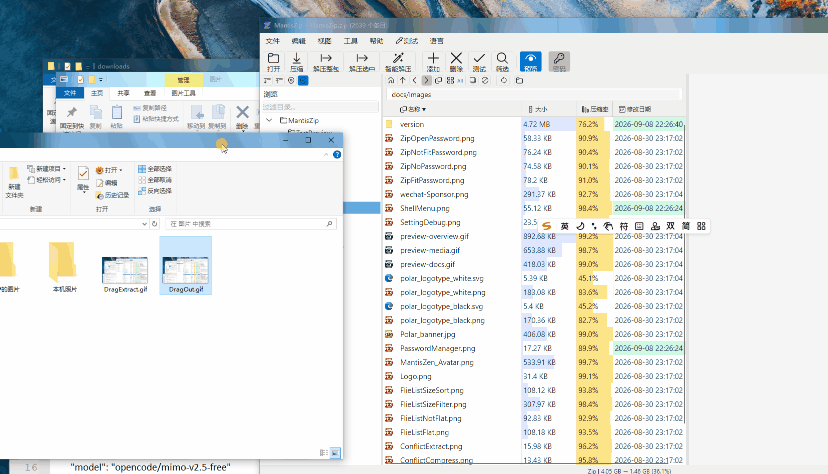
- 文件列表列排序增强 — 点击列头三态循环（升序→降序→恢复原始顺序）+ 列头箭头指示 + 排序状态跨会话持久化
- Enhanced file list column sorting — clicking a column header cycles ascending → descending → original order, with header arrow indicator and cross-session sort persistence
- 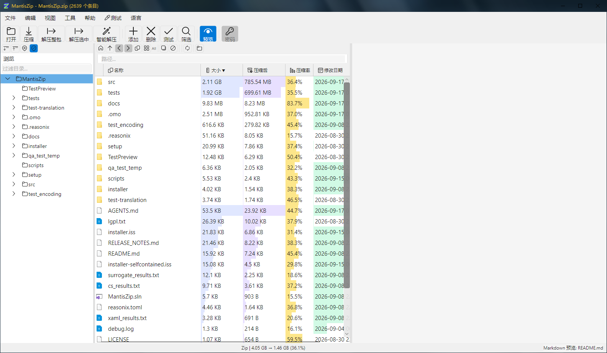
- 目录行聚合显示 — 目录行大小/日期/压缩后大小由子树聚合得出（大小=子树文件之和、日期=最新文件时间），一眼看清目录内容规模
- Directory row aggregation — directory rows show aggregated size/date/compressed size from their subtree (size = sum of contained files, date = newest file), so folder sizes are visible at a glance
- 保存布局 — 拖动列宽/预览面板调整后可一键保存，「查看」菜单保留布局项，下次启动自动恢复
- Save layout — after resizing columns or the preview panel, save once and it restores automatically on next launch (View menu → "Save Layout")

## v0.4.5

### 文件说明 / File Description

MantisZip-0.4.5-Setup-WebSetup.exe 是需要联网才能安装的。MantisZip-0.4.5-Setup-Offline.exe 是离线安装包。MantisZip-0.4.5-Portable.zip 是便携版，解压即用。

MantisZip-0.4.5-Setup-WebSetup.exe requires internet during installation. MantisZip-0.4.5-Setup-Offline.exe is a fully offline installer. MantisZip-0.4.5-Portable.zip is the portable version, extract and run.

### 更新内容 / Changelog

- 完成 [压缩选项增强](.omo/plans/已完成/compression-options-enhancement.md) 计划 — 7z 字典大小、固实块、Word Size、匹配器可配置；ZIP 压缩方法（Deflate/Deflate64/BZip2/LZMA/PPMd/Store）可配置；ZIP/7z 加密方式可配置，7z 支持加密文件名开关
- Completed [Compression Options Enhancement](.omo/plans/已完成/compression-options-enhancement.md) plan — configurable 7z dictionary size, solid block, word size, match finder; configurable ZIP compression method (Deflate/Deflate64/BZip2/LZMA/PPMd/Store); configurable ZIP/7z encryption method, 7z encrypt headers toggle
- 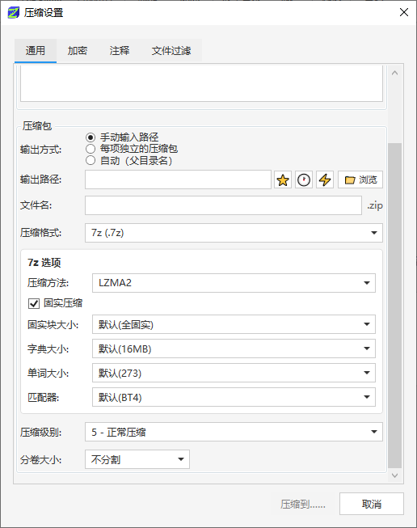
- 完成 [文件过滤功能](.omo/plans/已完成/file-filter-feature.md) 计划 — 支持按扩展名、文件名、尺寸、日期过滤，可保存为命名预设
- Completed [File Filter](.omo/plans/已完成/file-filter-feature.md) plan — filter by extension, filename, size, or date range; supports named presets persisted in settings
- 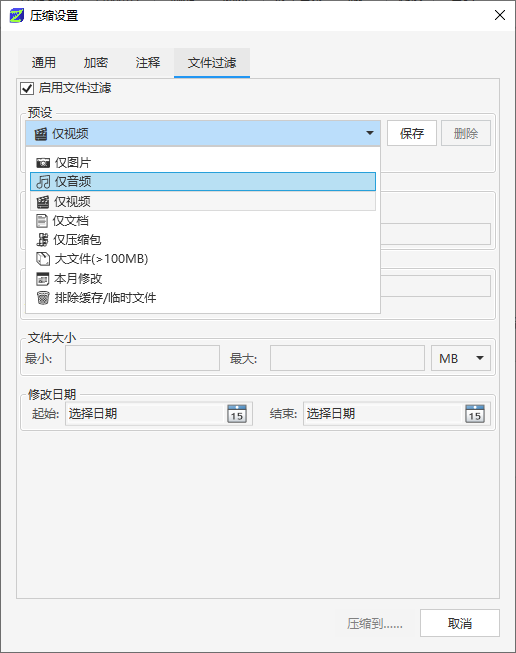
- 新增便携模式，CI 自动生成 Portable 压缩包
- Added portable mode; CI automatically generates Portable zip
- 解压路径统一 — `ExtractSelectedAsync` 改为调用引擎 `ExtractEntriesAsync`
- Unified extract path — `ExtractSelectedAsync` now delegates to engine `ExtractEntriesAsync`
- 视图菜单新增"隐藏预览信息"开关，预览信息面板可独立显隐控制
- Added "Hide Preview Info" toggle in View menu for independent control of preview info panel visibility
- 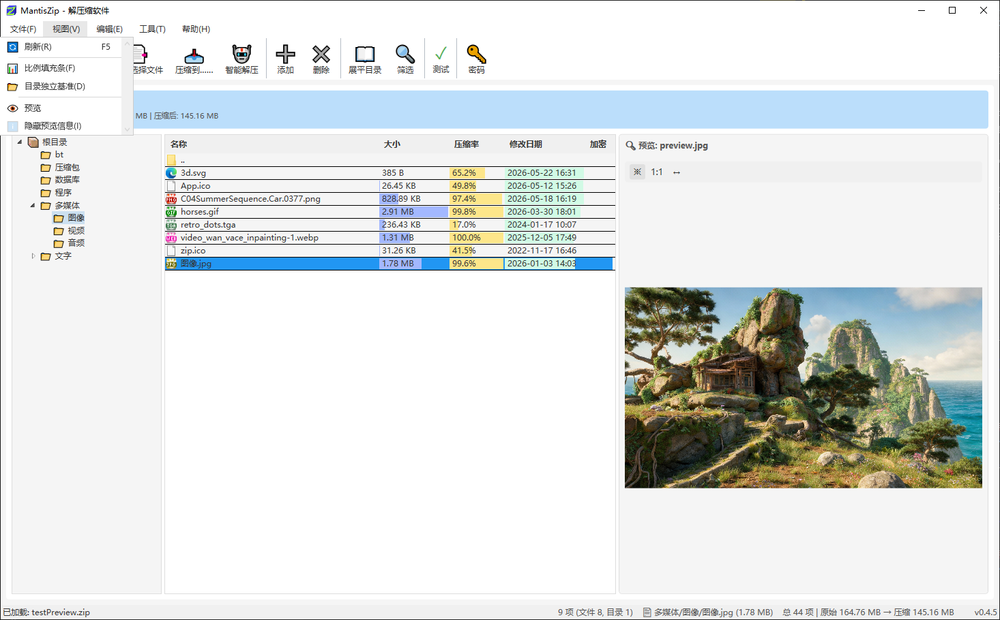
- 可配置双击行为 — 设置窗口新增"双击压缩包"选项（打开/原地解压/智能原地解压/打开解压窗口），`--open` CLI 按配置路由 (#16)
- Configurable double-click behavior — new "double-click archive" option in Settings (open/extract-here/smart-extract/extract-dialog); `--open` CLI routes accordingly
- 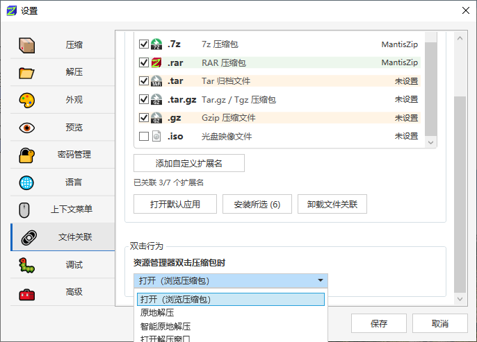
- 解压后自动删除原压缩包 — 新增"解压完成后将原压缩包移到回收站"选项，(#16)
- Auto-delete archive after extraction — new option to move original archive to Recycle Bin
- 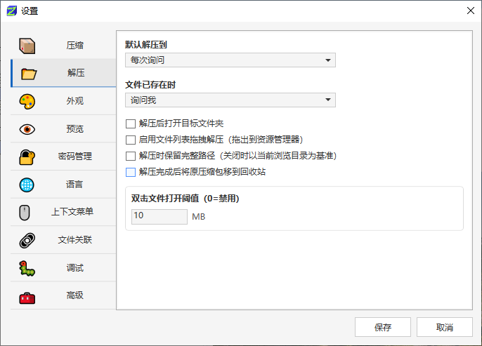
- 文件冲突窗口增加“暂停”和“取消”按钮。(#25)
- Add ‘Pause’ and ‘Cancel’ buttons to the file conflict window.
- 
- 修复安装后会导致别的软件安装完启动时错误本软件的问题。
- Fixed issue where installing other software could incorrectly route their startup to MantisZip.

## v0.4.4

### 文件说明 / File Description

MantisZip-0.4.4-Setup-WebSetup.exe 是需要联网才能安装的。MantisZip-0.4.4-Setup-Offline.exe 是离线安装包。

MantisZip-0.4.4-Setup-WebSetup.exe requires internet during installation. MantisZip-0.4.4-Setup-Offline.exe is a fully offline installer.

### 更新内容 / Changelog

- 完成 [魔数检测预览系统](.omo/plans/已完成/preview-magic-detection.md) 计划 — 通过文件内容（魔数）识别真实格式预览，不再依赖扩展名
- Completed [Magic Detection Preview System](.omo/plans/已完成/preview-magic-detection.md) plan — identifies file formats by content (magic bytes) for preview, no longer relies on file extensions
- 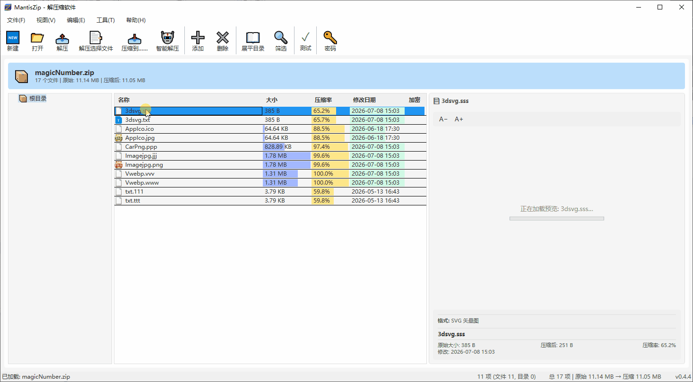
- 魔数检测结果与扩展名不一致时，可在工具栏切换"按扩展名/按魔数"预览
- When magic detection conflicts with the file extension, toggle between "by extension / by magic number" preview in the toolbar
- 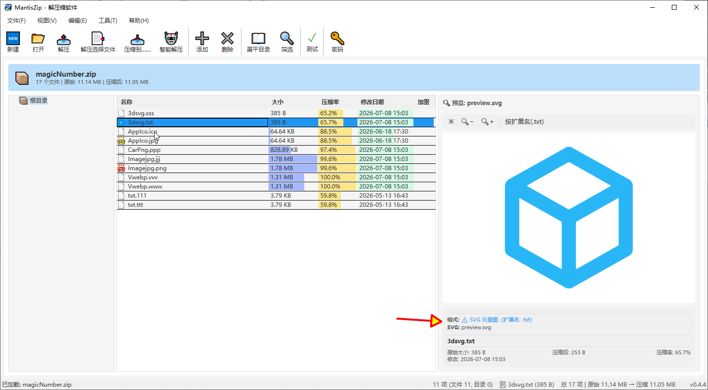
- 完成压缩包路径处理一站式重构 `ArchivePath`，统一了散落在各处的路径处理代码，并修复了加密压缩解压的多处 bug
- Completed one-stop archive path refactoring (`ArchivePath`), unified scattered path handling code, and fixed multiple encryption-related compression/extraction bugs
- 密码流程统一重构 — 统一密码入口 `ResolvePasswordAsync`，调用方大幅简化
- Unified password flow refactoring — centralized password entry via `ResolvePasswordAsync`, significantly simplified callers
- 双击文件用系统默认程序打开（可在设置中调整阈值）
- Double-click files to open with system default program (threshold configurable in settings)
- 安装包增强，文件名重命名：`WebSetup`（联网）/ `Offline`（离线），联网安装包可自动下载所需依赖
- Installer improvements: renamed to `WebSetup` (online) / `Offline` (offline); online installer automatically downloads required dependencies
- 离线安装包新增自包含模式，无需安装 .NET Runtime
- Offline installer now includes self-contained mode, no .NET Runtime installation required

## v0.4.3

### 文件说明 / File Description

MantisZip-0.4.3-Setup-NoDotNet.exe 是需要安装 dotnet runtime 才能运行的。MantisZip-0.4.3-Setup.exe 是自包含 dotnet runtime 的。

MantisZip-0.4.3-Setup-NoDotNet.exe requires the .NET runtime to be installed. MantisZip-0.4.3-Setup.exe is self-contained with the .NET runtime.

**如果你不明白上面那句话是什么意思，请下载 MantisZip-0.4.3-Setup.exe。**

**If you don't understand what the above means, please download MantisZip-0.4.3-Setup.exe.**

### 更新内容 / Changelog

- 完成 [快速路径选择](.omo/plans/已归档/quickpath-unified.md) 计划。
- Completed [Quick Path Selection](.omo/plans/已归档/quickpath-unified.md) plan.
- 快速路径选择，在"浏览"按钮旁边加上三个用于切换路径的按钮。（灵感来自软件 Listary）
- Quick Path Selection: added three buttons next to the "Browse" button for switching paths. (Inspired by Listary)
- 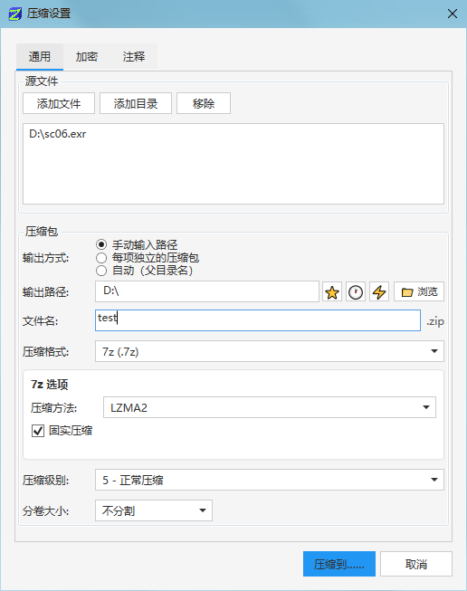
- 可以把常用路径加入书签，在"书签"按钮弹出菜单里面选择并切换。
- Frequently used paths can be bookmarked and selected via the "Bookmark" button popup menu for quick switching.
- 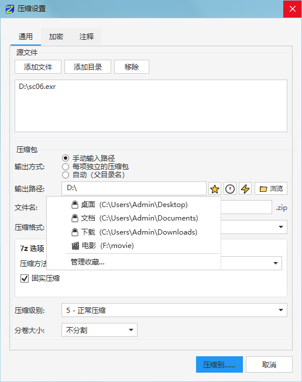
- 可以在书签管理器里面管理书签。
- Bookmarks can be managed in the Bookmark Manager.
- 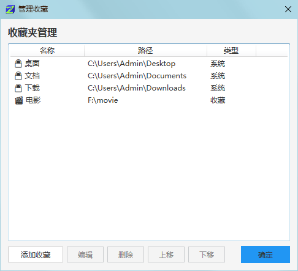
- "历史"按钮，弹出菜单里面会显示最近的用到的目录并切换。
- The "History" button shows recently used directories in a popup menu for quick switching.
- 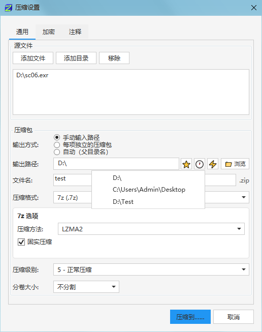
- "切换"按钮，弹出菜单里面会显示此时打开的资源管理器目录并切换。
- The "Switch" button shows currently open Explorer directories in a popup menu for quick switching.
- 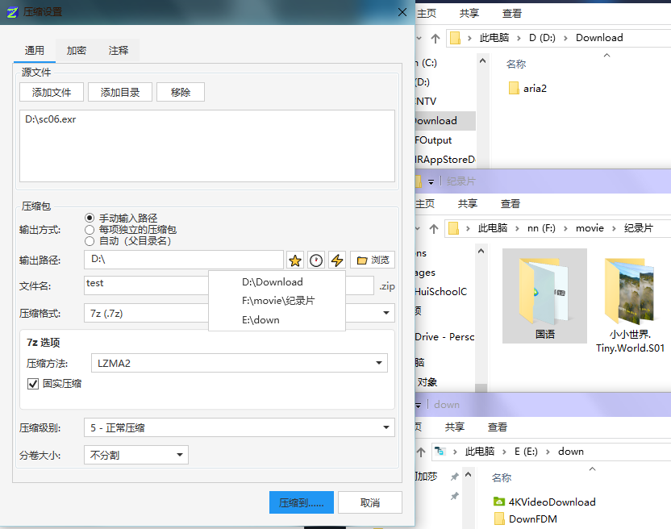

## v0.4.2

### 文件说明 / File Description

MantisZip-0.4.2-Setup-NoDotNet.exe 是需要安装 dotnet runtime 才能运行的。MantisZip-0.4.2-Setup.exe 是自包含 dotnet runtime 的。

MantisZip-0.4.2-Setup-NoDotNet.exe requires the .NET runtime to be installed. MantisZip-0.4.2-Setup.exe is self-contained with the .NET runtime.

**如果你不明白上面那句话是什么意思，请下载 MantisZip-0.4.2-Setup.exe。**

**If you don't understand what the above means, please download MantisZip-0.4.2-Setup.exe.**

### 更新内容 / Changelog

- 修复上下文动态菜单有时会闪烁的问题。
- Fixed issue where dynamic context menus sometimes flickered.
- 修复安装时选择语言和外观无效的问题（感谢 Peiming_The_Blank）。
- Fixed issue where language and appearance selection during installation was ineffective (thanks to Peiming_The_Blank).
- 完成计划 [zip 复制模式](.omo/plans/已完成/zipengine-sharpcompress-migration.md)，添加删除文件不再是"解压缩→重新压缩"，而改成了"复制模式"。速度极大提升。
- Completed plan: [ZIP copy mode](.omo/plans/已完成/zipengine-sharpcompress-migration.md). Adding/deleting files now uses "copy mode" instead of "decompress → recompress". Significantly faster.
- 完成计划 [权限提升](.omo/plans/已完成/uac-elevation-permission.md)，当压缩解压到无权限的目录时，会有正确的处理（感谢 xieyilin.main）。
- Completed plan: [UAC elevation](.omo/plans/已完成/uac-elevation-permission.md). Proper handling when compressing/extracting to directories without permission (thanks to xieyilin.main).
- 
- 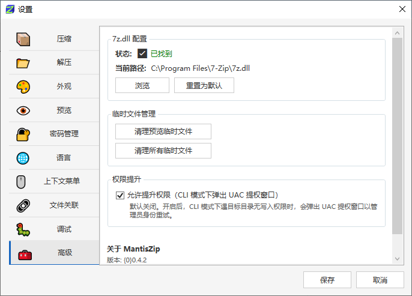
- 

## v0.4.1

### 文件说明 / File Description

MantisZip-0.4.1-Setup-NoDotNet.exe 是需要安装 dotnet runtime 才能运行的。MantisZip-0.4.1-Setup.exe 是自包含 dotnet runtime 的。

MantisZip-0.4.1-Setup-NoDotNet.exe requires the .NET runtime to be installed. MantisZip-0.4.1-Setup.exe is self-contained with the .NET runtime.

**如果你不明白上面那句话是什么意思，请下载 MantisZip-0.4.0-Setup.exe。**

**If you don't understand what the above means, please download MantisZip-0.4.0-Setup.exe.**

### 更新内容 / Changelog

- 修复上下文动态菜单有时不能起效的问题，并增加了不使用动态菜单的选项
- Fixed issue where dynamic context menus sometimes didn't work, and added an option to disable dynamic menus
- 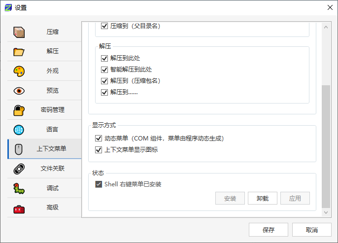
- 文件列表增加回到父目录的行
- Added a "go to parent directory" row in the file list
- 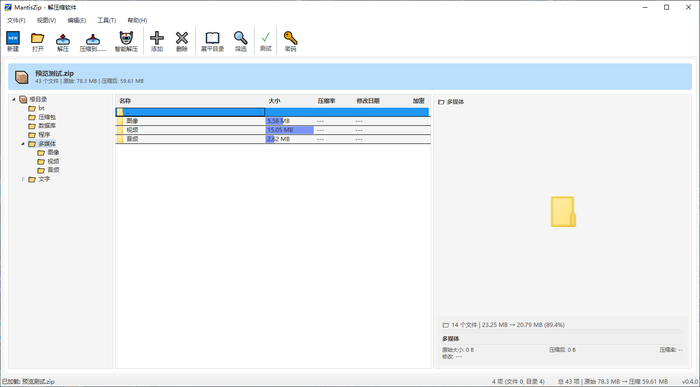
- 文件列表目录回车改成进入该目录
- Changed Enter key on directories in the file list to navigate into that directory

## v0.4.0

### 文件说明 / File Description

MantisZip-0.4.0-Setup.exe 是需要安装 dotnet runtime 才能运行的。MantisZip-0.4.0-Setup-SelfContained.exe 是自包含 dotnet runtime 的。

MantisZip-0.4.0-Setup.exe requires the .NET runtime to be installed. MantisZip-0.4.0-Setup-SelfContained.exe is self-contained with the .NET runtime.

**如果你不明白上面那句话是什么意思，请下载 MantisZip-0.4.0-Setup-SelfContained.exe。**
**If you don't understand what the above means, please download MantisZip-0.4.0-Setup-SelfContained.exe.**

### 软件第一个版本 / First Release

- 软件功能基本完整，测试基本完成。
- Core features are complete and testing is largely finalized.
- 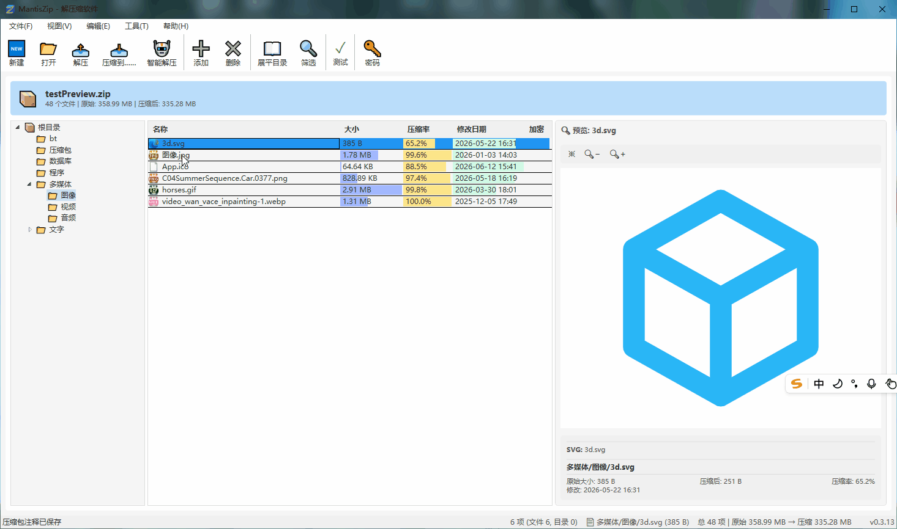
- 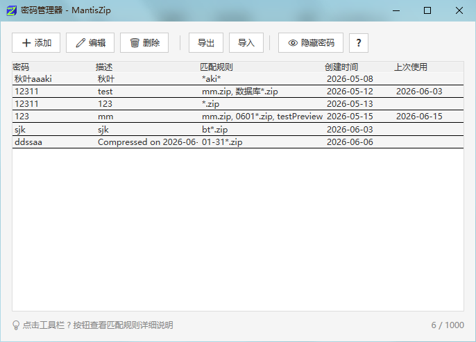

## v0.0.0

# Release Notes / 发布说明

> **每次发布前在此文件顶部写入本次更新的内容，CI 会自动将其作为 GitHub Release 的说明文字。**
> **Write the update notes at the top of this file before each release. CI will automatically use them as the GitHub Release description.**
>
> 保留之前版本的记录在下面供参考，上面最新内容会被 CI 读取。
> Keep records of previous versions below for reference. The latest content at the top will be read by CI.
