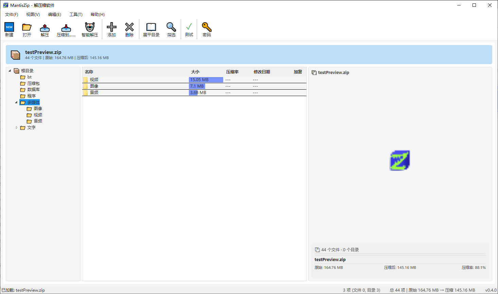
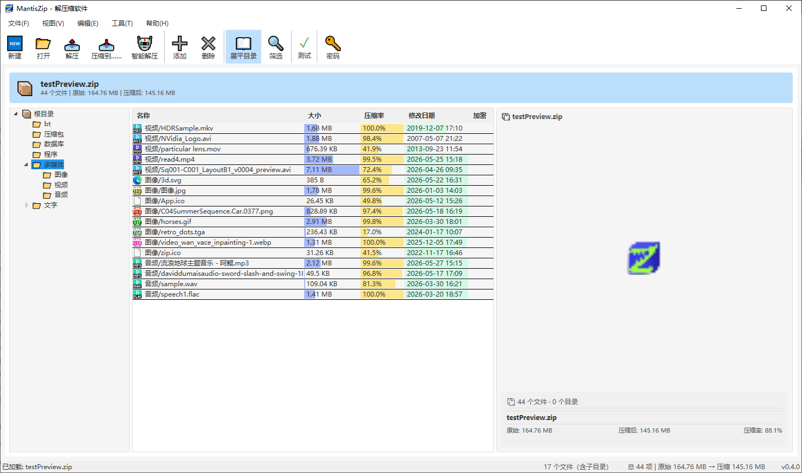

> 🌐 Language: 中文 | [English](/docs/README_en.md)

<div align="center">

# MantisZip


Lightweight full-featured Windows compression/decompression tool
</p>

<p align="center">
  <a href="https://buy.polar.sh/polar_cl_VaCaW2l2nWkob5CyHe4dOlhL6HrQDK4ueMA9n1JyhNc"></a>
  <a href="https://afdian.com/a/MantisZen"></a>
  <a href="https://dotnet.microsoft.com/"></a>

  [](https://qm.qq.com/cgi-bin/qm/qr?k=778347352) 
  [](https://discord.gg/PpuyhceJpZ)

</p>

----


 ⏱️ 3-second overview: seamless switching and instant preview inside archives

> Free & Open Source / Built on .NET 9 + WPF   
> 🤖 AI-assisted development by [OpenCode](https://opencode.ai) and [Reasonix](https://reasonix.io)
</div>

----

<p align="center">
  <b>👁 Preview</b> &nbsp;·&nbsp; <b>🔑 Password Manager</b> &nbsp;·&nbsp; <b>⚙️ Advanced Extraction Options</b>
</p>

---

## 📚 Introduction

MantisZip is a free, open-source compression/decompression tool for Windows, featuring **in-archive preview** and **password manager** for enhanced convenience. You can directly view images, text, Markdown, HTML, and more inside archives without extracting them first.

## ✨ Feature Highlights

### 👁️ In-Archive Preview

Preview **images**, **text**, **HTML/Markdown**, **SVG**, **fonts**, and more directly inside archives.

#### 🔍 Deep Dive: Advanced Preview Spotlights

<table width="100%">
  <tr>
    <td width="50%" valign="top">
      <b>🖼️ Media & Image Preview</b><br>
      Supports PNG transparency channel display, and embedded GIF animation playback inside archives.
      
    </td>
    <td width="50%" valign="top">
      <b>📄 Document & Typography Preview</b><br>
      Seamlessly switch between plain text, real-time Markdown rendering, HTML, PDF, and font glyph preview.
      
    </td>
  </tr>
</table>

#### Some formats support **metadata display** (no full file loading required):

<details>
<summary><b>📊 Click to expand: In-depth data previews (SQLite databases, CSV, BitTorrent, ISO)</b></summary>

| Preview Type | Information Displayed |
|----------|----------|
| PE executable (exe/dll) | Company, product name, file version, architecture, subsystem, description |
| PDF document | Version, page count, title, author, encryption status |
| Office document (docx/xlsx/pptx) | Title, author, page/slide/worksheet count |
| Audio (WAV / FLAC) | Duration, sample rate, bit depth, channels, bitrate |
| Video (MP4 / MKV / AVI) | Resolution, duration, codec |
| Database (SQLite) | Encoding, page size, table count |
| Disc image (ISO) | Volume label, format, size |
| BitTorrent | InfoHash, file tree, Magnet link, Tracker, creator |
</details>

----

### 🔑 Smart Password Manager


Save frequently used passwords and auto-match them by rules.

If a correct password is entered for a file, you can choose to save it — no need to re-enter next time you open or extract it. Passwords are encrypted with DPAPI.

Supports import/export (plain JSON) for backup and migration. Max 1000 entries; auto-try limited to the first 100 entries to prevent brute-force abuse.

<details>
<summary><b>📊 Click to expand: Password & rule setup and matching</b></summary>
<p align="center">
  <br>
  During compression, you can load a password from the library or manually enter a new one.

  

  Opening a password-protected file prompts for password entry and rule saving.

  

  Once the password and matching rules are correctly set, subsequent opens match automatically without notice, and preview functions work seamlessly.

  

  If the password or matching rules are not correctly configured, a lock icon is shown and preview is disabled.

  
</p>
</details>

----

### ⚡ More Extraction Conflict Options

Beyond the usual "Overwrite", "Skip", and "Auto-rename", adds **"Overwrite older files"** and **"Overwrite smaller files"**. "Auto-rename" can also seamlessly switch to manual rename.


----

### File List Enhancements

The file list now includes a size ratio bar, directory flattening, and filtering tools. Small tools that make a big difference in efficiency.

<details>
<summary><b>📊 Click to expand: Directory flattening and filtering tools</b></summary>
<p align="center">
  <br>

  The size ratio bar provides a visual overview of file sizes and dates in the current directory at a glance.

  

  ----

  Flattening the directory shows files from the current directory and all its subdirectories.

  

  ----

  Column sorting lets you sort the list by any column's data.

  

  ----

  File list filtering lets you display only the files you need based on rules.

  

</p>
</details>

----


---

## 🤔 Known Issues
- This software prioritizes features and usability, so performance may lag behind mainstream compression tools. Optimization will come in future releases.
- **Drag-and-drop export** uses 7-Zip's eager-extraction model (extracts all files to temp before initiating drag), causing delays with many large files. This feature is off by default and can be enabled in settings. Future migration from WPF to Avalonia will natively resolve this platform's deferred rendering limitation.
- Markdown, HTML, SVG, and PDF preview currently use the WebView2 control, with all external network requests blocked (only `file://` local access allowed). The architecture will be further streamlined after migrating to Avalonia.
- Some archive formats do **not** support single-entry preview — a prompt will be shown in such cases.
- RAR format does not support compression (read-only extraction).
- Currently only supports Windows; cross-platform support is planned.


---

## 📦 Supported Formats

| Format | Compress | Extract | Encrypt |
|------|:----:|:----:|:----:|
| ZIP | ✅ | ✅ | ✅ AES-256 |
| 7z | ✅ | ✅ | ✅ |
| TAR | ✅ | ✅ | ❌ |
| GZ / TGZ | ✅ | ✅ | ❌ |
| RAR | ❌ | ✅ | ✅ |
| ISO | ❌ | ✅ (read-only browsing) | ❌ |

---

## 📋 System Requirements

- **OS**: Windows 10 (1809+) / Windows 11 (cross-platform support is planned)
- **Runtime**: [.NET 9 Runtime](https://dotnet.microsoft.com/download/dotnet/9.0)
- **WebView2 Runtime**: HTML/Markdown/SVG/PDF preview requires [WebView2 Runtime](https://developer.microsoft.com/microsoft-edge/webview2/)

---

## 🔧 Build

```powershell
# Clone the repository
git clone https://github.com/mantis3d/MantisZip.git
cd MantisZip

# Build
dotnet build src\MantisZip.UI\MantisZip.UI.csproj

# Run
dotnet run --project src\MantisZip.UI\MantisZip.UI.csproj

# Run tests
dotnet test tests\MantisZip.Tests\MantisZip.Tests.csproj
```

**Output path**: `src/MantisZip.UI/bin/Debug/net9.0-windows/MantisZip.UI.exe`

---

## ⌨️ CLI

MantisZip supports powerful command-line invocation (e.g., for context menu integration).

```powershell
# Open an archive for browsing
MantisZip.UI.exe --open "D:\Documents.zip"

# Quick compress (default settings)
MantisZip.UI.exe --compress-quick "D:\Photos" -- "D:\backup.zip"
```

See the [CLI Guide](CLI.md) for the full parameter list.

---

## 🏗 Architecture

See the [Architecture Document](ARCHITECTURE.md) for details on module structure and technology stack design.

---

## 📄 License

This project is licensed under the **MIT License** — see the [LICENSE](../LICENSE) file for details.

---

## 📦 Download & Installation

| Channel | Link | Access Code | Audience |
| :--- | :--- | :--- | :--- |
| **Quark Cloud Drive** | [👉 Download](https://pan.quark.cn/s/ae193b2aa11b) | **`mTZH`** | **Recommended for China**! No speed limits on mobile/PC, supports one-click save and fast sync. |
| **Baidu Cloud Drive** | [👉 Download](https://pan.baidu.com/s/1CJXNu1M1ARkH2hf48mfb-g?pwd=yevn) | **`yevn`** | Alternative domestic channel for users accustomed to the Baidu ecosystem. |
| **Official QQ Group** | [👉 Join Group (778347352)](https://qm.qq.com/cgi-bin/qm/qr?k=778347352) | *No verification* | **Highly recommended**! One-click download of latest builds, early access betas, direct feedback to the developer. |

---

## 🙏 Acknowledgments

MantisZip would not exist without the generous contributions of the global open-source community. We extend our deepest gratitude to the excellent open-source libraries, tools, and their creators on which this project depends.

### 📦 Core Third-Party Libraries

#### MantisZip.Core

| Package | Version | Purpose | License |
|------|------|------|--------|
| [SharpCompress](https://github.com/adamhathcock/sharpcompress) | 0.48.1 | Core ZIP/TAR/GZ compression and decompression engine (replaces SharpZipLib) | MIT |
| [SharpSevenZip](https://github.com/sevenzipsharp/SevenZipSharp) | 2.0.45 | 7z/RAR/ISO compression and decompression (wraps 7z.dll) | LGPL-2.1 |
| [SharpZipLib](https://github.com/icsharpcode/SharpZipLib) | 1.4.2 | Testing only (test project) | MIT |
| [System.Security.Cryptography.ProtectedData](https://github.com/dotnet/runtime) | 10.0.8 | DPAPI-encrypted password storage | MIT |

#### MantisZip.UI

| Package | Version | Purpose | License |
|------|------|------|--------|
| [CommunityToolkit.Mvvm](https://github.com/CommunityToolkit/dotnet) | 8.4.2 | MVVM utilities (partial base classes only) | MIT |
| [Markdig](https://github.com/xoofx/markdig) | 1.2.0 | Markdown → HTML rendering | BSD-2-Clause |
| [Ookii.Dialogs.Wpf](https://github.com/ookii-dialogs/ookii-dialogs-wpf) | 5.0.1 | Vista-style folder picker dialog | BSD-3-Clause |
| [Ude.NetStandard](https://github.com/jehugaleahsa/udetector) | 1.2.0 | Mozilla charset detection (text preview) | MIT |
| [WpfAnimatedGif](https://github.com/XamlAnimatedGif/WpfAnimatedGif) | 2.0.2 | GIF animation support | MIT |
| [Microsoft.Web.WebView2](https://developer.microsoft.com/microsoft-edge/webview2/) | 1.0.3967.48 | HTML/Markdown/SVG/PDF preview (replaces WPF WebBrowser) | BSD-3-Clause |

#### External Tools (Runtime Dependencies)

| Tool | Purpose | License | Notes |
|------|--------|--------|------|
| [7z.dll](https://www.7-zip.org/) | Native 7z/RAR parsing (SharpSevenZip binding) | GNU LGPL | Distributed with app, dynamically linked |

---

### 🤖 Intelligent Development Assistance

During agile development and refactoring, this project deeply leveraged the following advanced AI coding agents, achieving a leap in independent development productivity:

- [OpenCode](https://opencode.ai) — Responsible for the foundational core async architecture and .NET 9 advanced feature refactoring.
- [Reasonix](https://reasonix.io) — Responsible for efficient development, deep debugging, and bug fixing of core business features (e.g., in-archive preview, smart password manager).
- [DeepSeek](https://www.deepseek.com) — Provided underlying hardcore programming large language model support throughout the project.

*(Special thanks to the above AI tools and the outstanding teams behind them!)*

---

## 💖 Support the Project

MantisZip is a completely free, independently developed open-source project. If it has boosted your productivity, consider fueling the developer with some continued motivation! ☕

### 🌐 International Sponsors
If you are outside of China, we recommend sponsoring via Polar. Supports international credit cards, Apple Pay, and more for seamless payment:
<p align="left">
  <a href="https://buy.polar.sh/polar_cl_VaCaW2l2nWkob5CyHe4dOlhL6HrQDK4ueMA9n1JyhNc">
    
    
  </a>
</p>

---

### 🇨🇳 Domestic Sponsors (China)
If you are in China, you can support via **Afdian (WeChat/Alipay)** or **WeChat direct donation**. Scan the QR codes below:

<table width="100%">
  <tr>
    <td width="50%" align="center" valign="top">
      <a href="https://afdian.com/a/MantisZen">
      <b>⚡ Support me on Afdian ⚡</b><br>      
        
      <br><i>(Click or scan to visit the Afdian page)</i>
      </a>
    </td>
    <td width="50%" align="center" valign="top">
      <b>💚 WeChat Direct Donation 💚</b><br><br>
      
      <br><i>(Buy the developer a cup of coffee ☕)</i>
    </td>
  </tr>
</table>


---


### 💬 Community & Feedback

If you encounter a bug, have a feature idea, or just want to chat about WPF/.NET independent development, feel free to join our developer community:

* **QQ Group**: `778347352` (👉 [Click to join](https://qm.qq.com/cgi-bin/qm/qr?k=778347352))
* **Code Repository**: [Submit a Bug or Feature Request](../../issues)
* **Discord**: (👉 [Click to join](https://discord.gg/PpuyhceJpZ))

> 💡 **Tip**: Please mention "GitHub / MantisZip" when joining the group.


## Star History

<a href="https://www.star-history.com/?repos=mantis3d%2FMantisZip&type=date&legend=top-left">
 <picture>
   <source media="(prefers-color-scheme: dark)" srcset="https://api.star-history.com/chart?repos=mantis3d/MantisZip&type=date&theme=dark&legend=top-left&sealed_token=nsZLw4F-DYdClMW8mHT8lwCV9ExHMuy4eC0Ebz22DGp8NwLlC9IeKT3cZ4St3gycAR-apUAwJHJQb_Ubr50GXL9coXR1_qyce_ljatXgN40WEtu__3LiPKBw94SyCSYK6YfgYgoMdU_JtzH6GPpNIlPCD5VsAQOr2yHW8s2qH64b9BJlbpdqn3TojxdQ" />
   <source media="(prefers-color-scheme: light)" srcset="https://api.star-history.com/chart?repos=mantis3d/MantisZip&type=date&legend=top-left&sealed_token=nsZLw4F-DYdClMW8mHT8lwCV9ExHMuy4eC0Ebz22DGp8NwLlC9IeKT3cZ4St3gycAR-apUAwJHJQb_Ubr50GXL9coXR1_qyce_ljatXgN40WEtu__3LiPKBw94SyCSYK6YfgYgoMdU_JtzH6GPpNIlPCD5VsAQOr2yHW8s2qH64b9BJlbpdqn3TojxdQ" />
   
 </picture>
</a>